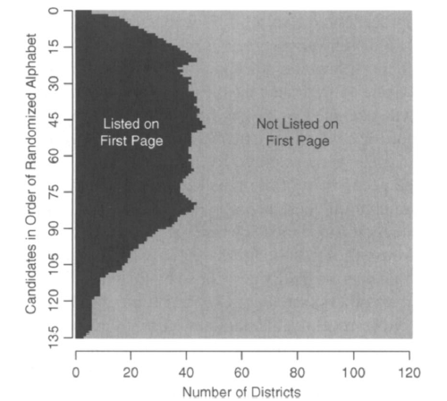
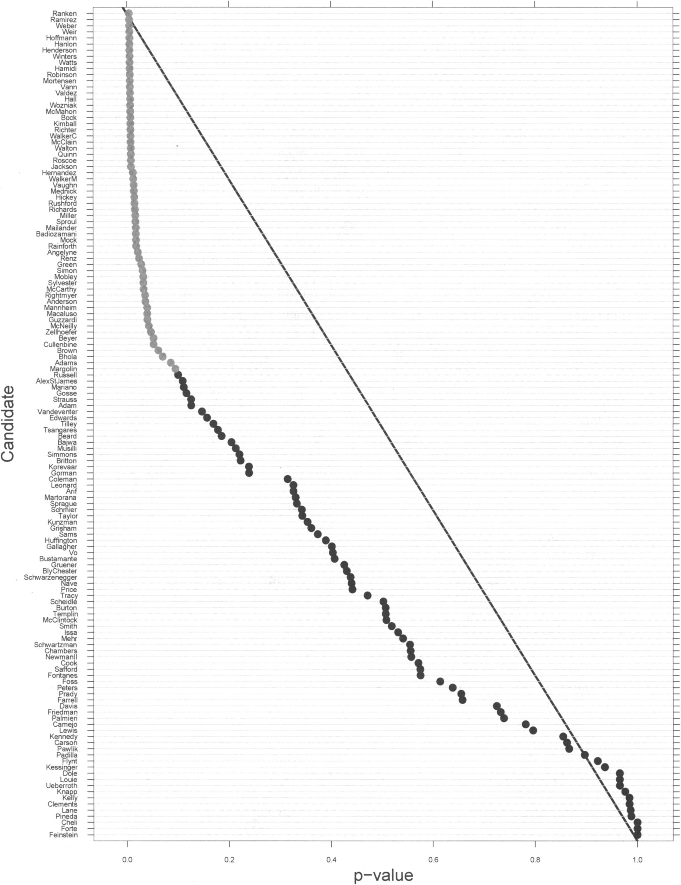
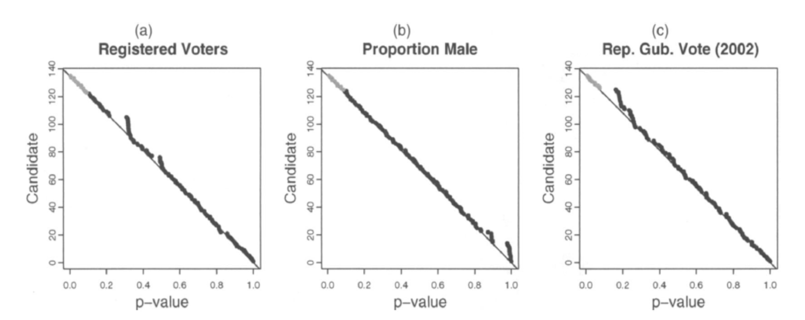

class: title-slide

```{r setup, include=FALSE}
knitr::opts_chunk$set(echo = FALSE, fig.path = "figures/")

library(tidyverse)
library(pacman)
library(janitor)
library(sandwich)
#library(nnet)
#library(mlogit)
library(readr)
library(clubSandwich)
library(modelsummary)
library(estimatr)

p_load(tidyverse, foreign, reshape2, psych, qwraps2, forcats, readxl, 
       broom, lmtest, margins, plm, rdrobust, multiwayvcov,
       wesanderson, sandwich, stargazer,
       readstata13, pscore, optmatch, kdensity, MatchIt, bootstrap, matlib, dplyr)

xfun::pkg_load2(c('base64enc', 'htmltools', 'mime'))
```

```{css, echo = FALSE}
.huge .remark-code { /*Change made here*/
  font-size: 200% !important;
}
.tiny .remark-code { /*Change made here*/
  font-size: 60% !important;
}
```

.title[
# Sesión 12. Inferencia por aleatorización
]
.subtitle[
## Evaluación de Programas Sociales
]
.author[
### Irvin Rojas <br> [rojasirvin.com](https://www.rojasirvin.com/) <br> [<i class="fab fa-github"></i>](https://github.com/rojasirvin) [<i class="fab fa-twitter"></i>](https://twitter.com/RojasIrvin) [<i class="ai ai-google-scholar"></i>](https://scholar.google.com/citations?user=FUwdSTMAAAAJ&hl=en)
]

.affiliation[
### Centro de Investigación y Docencia Económicas <br> División de Economía
]

---
# Agenda

1. Estudiaremos una alternativa para realizar inferencia explotando la incertidumbre que surge de la asignación de los tratamientos

1. Algunos investigadores consideran que las evaluaciones basadas en variación experimental deberían recaer en este tipo de inferencia 

---

class: inverse, middle, center

# Inferencia por aleatorización

---

# Inferencia por aleatorización

- Pensemos en que situaciones en que tenemos el control sobre la variación experimental

- Además, supongamos que observamos a la población de estudio completa

- En este caso, la única variación viene de la asignación del tratamiento, es decir, no hay error muestral

- Queremos entonces construir pruebas de hipótesis y valores $p$ que reflejen esta variación

---

# Inferencia por aleatorización

- Consideren cómo pensamos los desbalances en una prueba de balance en la línea base

- Decimos que esperaríamos cierto porcentaje de hipótesis nulas rechazadas aún cuando todas fueran verdaderas por razones del azar

- Esto solo tiene sentido cuando pensamos en muestras

- Si tuviéramos acceso a toda la población, tenemos que pensar en que la única fuente de variación es la asignación aleatoria

- El siguiente ejemplo, con una asignación bastante compleja, nos ayuda a pensar en una forma distinta de hacer inferencia


---

# Aplicación a las elecciones en California

- Randimization Inference with Natural Experiments (Ho & Imagi, 2006)

- Se reunieron las firmas necesarias para convocar a elecciones de un nuevo gobernador (*recall election*)

--

- Anteriormente, el funcionario en turno y que buscaba reelegirse aparecía en la primera página

- Una nueva ley ordenío aleatorizar el orden de aparición en la primera página

- ¿Cómo afecta el aparecer en la primera página la probabilidad de ser electo?

---

# Diseño de la asignación

.pull-left[
- Hubo 135 candidatos

- Particularidad: cada condado diseña su boleta, lo cual hace distinto el número de páginas

- Las unidades de análisis son 121 distritos que tienen boletas de más de una página

- La Figura 1 muestra las veces en que cada candidato aparece en la primera página

- Podemos definir $T_i=\begin{cases}1 \quad\text{estar en la primera página} \\ 0 \quad\text{otr caso}\end{cases}$

- $y_i$ es el porcentaje de votos recibido en el distrito $i$
]


.pull-right[
```{r, out.width="100%",fig.cap='Fuente: Ho & Imai (2006)',fig.align='center'}

```
]

---

#Asignación aleatoria

- Se conoce el mecanismo asignación aleatoria

- Se realizó un sorteo para determinar el orden de las letras del alfabeto:

  - R, W, Q, O, J, M, V, A, H, B, S, G, Z, X, N, T, C, I, E, K, U, P, D, Y, F, L

--

- El distrito 1 tomó este orden para ordenar a los candidatos en su boleta

- El distrito dos pasó R al final y los ordenó de acuerdo a:

  - W, Q, O, J, M, V, A, H, B, S, G, Z, X, N, T, C, I, E, K, U, P, D, Y, F, L, R

--

- Y así hasta llegar al distrito 121
---

# Resultados potenciales

- Podemos pensar en el efecto de estar en la primer página en el distrito $i$ $\tau_i=y_{1i}y_{0i}$

- Para cada candidato tenemos 121 efectos

- Definamos una prueba exacta de Fisher:

$$H_0:\quad\tau_i=0\quad\forall\quad i=1,2,\ldots,121$$
--

- Esta hipótesis indica que la fracción de votos que recibe un candidato en cada distrito es la misma, sin importar la página en que aparece

- A esto se le conoce como una $H_0$ estricta o *sharp* porque se refiere al efecto en **cada** distrito en vez del efecto promedio

- Balo la $H_0$, $y_i=y_{1i}$ para quienes aparecen en la primera página 

---

# Estadísticos de prueba

- Consideremos el siguiente estadístico de prueba para una diferencia de medias:

$$W(T)=\frac{\sum_{i=1}^{121}T_iy_i}{N_1}-\frac{\sum_{i=1}^{121}(1-T_i)y_i}{N_0}$$

- Bajo la $H_0$, los resultados potenciales son conocidos y corresponden al resultado observado $y_i$

- Bajo la $H_0$ estricta, lo único que es aleatorio es la asignación de $T_i$

--

- El estadístico de prueba con los datos observados se define como $W(t)$

---

# Rechazo de la $H_0$

- Como conocemos la regla de asignación, podemos calcular la probabilidad de que $W(T)$ sea mayor que el observado $W(t)$:

$$p=P(W(T)\geq W(t))$$

- Comparamos esa probabilidad con el valor $\alpha$ elegido para la investigación

- Si la probabilidad es menor que $\alpha$, rechazamos la $H_0$ estricta

- La prueba no asume ninguna distribución

---

# Estimación de los valores $p$

- Idealmente, calcularíamos $W(T)$ para todas las posibles formas de asignar el tratamiento

- Esto es prácticamente imposible (hay $23!$ formas de ordenar el alfabeto)

- Se realiza una proximación Monte Carlo con $m$ repeticiones

- En cada una de las $j=1,\ldots,m$ repeticiones, se hace el sorte del alfabeto y se obtiene $W(T^{j})$

- Luego comparamos $W(T^{j})$ con $W(t)$, lo que vemos en los datos

- El valor $p$ se aproxima como sigue:

$$p=\frac{1}{m}\sum_{j=1}^m I \left(W(T^{j})\geq W(t)\right)$$
donde $I$ es una variable indicadora que toma el valor de 1 si $W(T^{j})\geq W(t)$


---

# Estimación de los valores $p$

- $p$ nos dice la fracción de las veces en que la diferencia fue mayor que la observada en los datos

- En otras palabras, estamos preguntándonos qué tan *raro* o poco probable de ver es $W(t)$ entre la distribución simulada

- Si $p$ es pequeño, es poco probable que se haya obtenido $W(t)$ por cuestiones de azar

--

- Si ahora pensamos en los 135 candidatos, esperaríamos que los valores $p$ se distribuyeran de manera uniforme

- Más aún, esperaríamos que, si $\alpha=0.10$, se rechazara la $H_0$ para 14 candidatos por cuestiones de azar, aún cuando no haya un efecto de aparecer en la primera página

---

# Efecto de aparecer en la primera página

.pull-left[
- La Figura 2 muestra a los 135 candidatos, ordenados por la magnitud de $p$

- En 59 casos el valor $p$ es menor que $\alpha$
]

.pull-right[
```{r, out.width="75%",fig.cap='Fuente: Ho & Imai (2006)',fig.align='center'}

```
]

---

# Efecto de aparecer en la primera página

```{r, out.width="70%",fig.cap='Fuente: Ho & Imai (2006)',fig.align='center'}

```

- La Figura 3 es como una prueba de balance

- Se realiza exactamente el mismo procedimiento, pero en vez de $y_i$, se analizan variables que no deberían estar afectadas por la asignación aleatoria

- Es lo que esperaríamos si la $H_0$ fuera verdadera


---

# Efecto de aparecer en la primera página

- Los autores dedican tiempo a comparar los resultados con lo que se obtendría con procedimientos convencionales, como MCO

- Por ejemplo, usando MCO, se concluiría que el candidato Schwarzenegger sí se benefició de aparecer en la perimera página

- En cambio, usando el procedimiento de inferencia por aleatorización, el valor $p$ del candidato indica que no se rechaza la $H_0$


---

# Por qué inferencia por aleatorización

- Incorporar el procedimiento de asignación a los métodos paramétricos vistos hasta ahora es complicado

- Por la asignación rotatoria, los candidatos tienen distintas probabilidades de ser asignados en las páginas en cada distrito

- La estimación de las varianzas de los estimadores sería aún más complicada

--

- La prueba exacta de Fisher nos permite incorporar exactamente el procedimiento de aleatorización

- Muchos econometristas, entre ellos Athey e Imbens han propuesto recurrir a los métodos de inferencia basada en aleatorización para tomar en cuenta la incertidumbre que surge de la asignación aleatoria al tratamiento y no del muestreo

- El procedimiento comienza a ser más usado en evaluaciones experimentales

- **No confundir con técnicas bootstrap**, como bien diferencia Jason Kerwin en [esta entrada](https://jasonkerwin.com/nonparibus/2017/09/25/randomization-inference-vs-bootstrapping-p-values/)

---

# Procedimiento general

- Más generalmente, podemos pensar el proceso de inferencia por aleatorización como sigue:

--

1. Asignar aleatoriamente el tratamiento *falso* siguiendo las mismas reglas de como se asignó el tratamiento original

1. Estimar el estadístico usado para probar la hipótesis nula usando la asignación *falsa* (lo cual puede ser un coeficiente de regresión, una diferencia de medias, un estadístico $t$, etc.)

  - Por construcción, el tratamiento *falso* tiene efecto promedio cero
  - Sin embargo, es posible rechazar la $H_0$ por razones de azar
  - Queremos ver cómo se compara el estadístico obtenido en los datos con la asignación verdadera en la distribución de estadísticos *falsos*
  
1. Coleccionar el estadístico obtenido y repetir $S$ veces, donde $S$ es lo suficientemente grande (1000 repeticiones suelen bastar)

1. Buscar el estadístico obtenido con los datos en la distribución del estadístico *falso*

1. Obtenemos el valor $p$ como el la fracción de repeticiones en las que $T\geq t$, donde $T$ y $t$ son estadísticos en general

---

# Ejemplos experimentales

- Kerwin y Thornton (2020) estudian la importancia de las complementariedades en insumos de programas de educación

- Estudian una intervención con dos tipos de tratamientos

  - Insumos de alta calidad
  
  - Versión ligera (60% más barata)
  
- $y_{is}$ es un test de lectura o escritura del alumno $i$ en la escuela $s$

- Programa en 38 escuelas

---

# Asignación del programa

- La asignación aleatoria se llevó a cabo a nivel *celda de estratificación*

- Una celda de estratificación consiste en tres escuelas que comparten características observables

  - En este caso era el centro coordinador escolar, el número de alumnos en el primer año y la distancia a la coordinación
  
- Dentro de cada celda, una escuela se asigna a control, otra al tratamiento completo y otra al tratamiento ligero


---

# Estimación

- Se especifica el siguiente modelo:

$$y_{is}=\beta_0+\beta_1 T_1+ \beta_2 T_2 + L_e'\gamma+\nu y_{is0}+\varepsilon_{is}$$

--

- Cuando el diseño tiene estratificación, se incluye una dummy para cada celda 

- Podemos estimar $\beta_1$ y $\beta_2$ por MCO

---

# Inferencia

- Los valores $p$ respectivos se calculan usando el mismo principio de inferencia por aleatorización:

  1. Para cada una de las $j=1,\ldots,1000$ repeticiones, se reasignan $T_1$, $T_2$ y $C$ en las mismas celdas de estratificación
  
  1. Se estiman $\beta_1^j$ y $\beta_2^j$
  
  1. Se obtiene la distribución de los efectos de tratamiento que tienen tiene esperanza cero por construcción
  
  1. Para $\beta_1$, se calcula el valor $p$ como la fracción de las veces en que los $\beta_1^j$ son mayores que $\beta_1^{MCO}$
  
---

# Resultados
  
- Los autores concluyen que, como posiblemente hubiéramos esperado, solo la versión completa del programa tiene efectos significativos

- El punto principal de la conclusión de los autores es sobre cómo se escalan los programas

- Los pilotos pueden (suelen) ser exitosos, pero si al escalarlos no se otorgan los beneficios completos, no se obtendrán los mismos resultados que en el piloto


---

# Próxima sesión

- Comenzaremos con diferencia en diferencias

- Diferencia en diferencias  
  + \* MM, Capítulo 5
  + CT, Capítulo 25, Sección 25.5  
  + \* GMPRV, Capítulo 7  

- Efectos fijos individuales  
  + \* MHE, Capítulo 5, Secciones 1, 2 y 3

---

class: center, middle

Presentación creada usando el paquete [**xaringan**](https://github.com/yihui/xaringan) en R.

El *chakra* viene de [remark.js](https://remarkjs.com), [**knitr**](http://yihui.org/knitr), y [R Markdown](https://rmarkdown.rstudio.com).

Material de clase en versión preliminar.

**No reproducir, no distribuir, no citar.**


