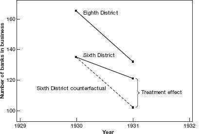

class: title-slide

```{r setup, include=FALSE}
knitr::opts_chunk$set(echo = FALSE, fig.path = "figures/")

library(tidyverse)
library(pacman)
library(janitor)
library(sandwich)
#library(nnet)
#library(mlogit)
library(readr)
library(clubSandwich)
library(modelsummary)
library(estimatr)
library(lubridate)
library(ExPanDaR) #for describing panel data
library(lfe)

p_load(tidyverse, foreign, reshape2, psych, qwraps2, forcats, readxl, 
       broom, lmtest, margins, plm, rdrobust, multiwayvcov,
       wesanderson, sandwich, stargazer,
       readstata13, pscore, optmatch, kdensity, MatchIt, bootstrap, matlib, dplyr)

xfun::pkg_load2(c('base64enc', 'htmltools', 'mime'))
```

```{css, echo = FALSE}
.huge .remark-code { /*Change made here*/
  font-size: 200% !important;
}
.tiny .remark-code { /*Change made here*/
  font-size: 60% !important;
}
```

.title[
# Sesión 13. Diferencia en diferencias
]
.subtitle[
## Evaluación de Programas Sociales
]
.author[
### Irvin Rojas <br> [rojasirvin.com](https://www.rojasirvin.com/) <br> [<i class="fab fa-github"></i>](https://github.com/rojasirvin) [<i class="fab fa-twitter"></i>](https://twitter.com/RojasIrvin) [<i class="ai ai-google-scholar"></i>](https://scholar.google.com/citations?user=FUwdSTMAAAAJ&hl=en)
]

.affiliation[
### Centro de Investigación y Docencia Económicas <br> División de Economía
]

---
# Agenda

1. Comenzaremos a estudiar situaciones en las que es imposible generar variación experimental

1. Veremos los supuestos sobre los que recae el uso de diferencia en diferencias en los casos más simples

1. Introduciremos el uso de regresión para la implementación del estimador


---

# Motivación 

- La estrategia de diferencia en diferencias especifica las condiciones bajo las cuales es posible identificar el efecto del tratamiento al comparar unidades tratadas y no tratadas, cuando se dispone de información antes y después de la intervención

- Esta estrategia es ampliamente utilizada para analizar el efecto de leyes y políticas que afectan a un grupo de individuos al mismo tiempo

- Además, constituye el fundamento para otro de los métodos en donde la investigación actual es muy activa, el control sintético

---

class: inverse, middle, center

# Diferencia en diferencias

---

# Diferencia en diferencias

.pull-left[
- Angrist & Pischke (2014) documental lo sucedido con el sector bancario en Mississippi durante la Gran Depresión

- En EUA, la FED tiene 12 bancos regionales y cada uno tiene autonomía para tomar decisiones de política monetaria

- En particular, Mississippi tiene una parte del estado bajo el mando del distrito 6 (Atlanta) y la otra mitad en el distrito 8 (San Luis)
]

.pull-right[
```{r, out.width="80%",fig.cap='Fuente: Richardson & Troost (2009)',fig.align='center'}
knitr::include_graphics("figures/banks_map.png")
```

]

---

# Diferencia en diferencias


- Como resuesta a las corridas bancarias que caracterizaron la crisis de 1929, los bancos comerciales en Mississippi se vieron expuestos a dos políticas distintas

$$
T=
\begin{cases}
1\quad\quad \text{proveer liquidez adicional (distrito 6)} \\
0\quad\quad \text{dar igual o menos liquidez (distrito 8)} \\
\end{cases}
$$


- Si estamos interesados en la cantidad de bancos que sobrevivieron y decir algo sobre qué política es más efectiva, ¿qué podemos hacer?

- Una primera respuesta sería contar la diferencia después de la crisis:

| Distrito 8 | Distrito 6 | Diferencia |
|:---:|:---:|:---:|
| $T=0$ | $T=1$ | |
| 132 bancos | 121 bancos | 11 bancos

--

- Pareciera que la política de proveer liquidez, *easy money*, **causó** que quebraran más bancos

- Sin embargo, esta comparación claramente ignora las condiciones iniciales


---

# Diferencia en diferencias

.pull-left[

- Podemos dar así una primera definición de lo que es la diferencia en diferencias del número de bancos que sobrevivieron a la Gran Depresión en Mississippi

$$
\begin{aligned}
\delta_{DiD}&=(Y_{6,post}-Y_{6,pre})-(Y_{8,post}-Y_{8,pre}) \\
&=(Y_{6,1931}-Y_{6,1931})-(Y_{8,1930}-Y_{8,1930}) \\
&=(121-135)-(132-165) \\
&-14+33 = 19
\end{aligned}
$$

- El estimador de DID toma en cuenta las diferencias inciales

- En este caso, el distrito 8 ya tenía más bancos abiertos que el 6 antes de la crisis

- DID construye un contrafactual para las unidades tratadas usando la pendiente de las unidades no tratadas

]

.pull-right[
```{r, out.width="100%",fig.cap='Fuente: Angrist & Pischke (2014)',fig.align='center'}

```
]


---

# Diferencia en diferencias

- El supuesto fundamental es el de **tendencias comúnes**, es decir, que en ausencia del tratamiento, el grupo de tratamiento se hubiera comportado igual al grupo de control

- Si hay varios puntos pre intervención, el supuesto de tendencias comúnes puede probarse empíricamente

---

# Regresión en DID

- El método puede generalizarse a más periodos de tiempo 

- Aquí, una regresión nos permite identificar el efecto del tratamiento

- Tenemos datos sobre el número de bancos en cada distrito en cada año (1929-1934)

$$y_{dt}=\alpha+\beta T_d+\gamma POST_t + \delta_{r,DID}(T_d\times POST_t)+e_{dt}$$
- $T_d$ es una dummy para los distritos tratados (distrito 6 en este caso)
  
  - Les llamamos **efectos fijos individuales** y sirven para controlar diferencias entre distritos que no cambian en el tiempo
  
- $POST_t$ es una dummy para los periodos post tratamiento (1931 en adelante)

- Al término $T_d\times POST_t$ se le conoce como el **término de interacción**, que es una dummy igual a 1 para los distritos tratados en los años post intervención

- $\delta_{r,DID}$ es el estimador de DID del efecto del tratamiento


---

# Regresión en DID


.pull-left[
```{r echo=T, include=T, eval=T, message=F, warning=F}
banks<-read_csv("./banks_mm.csv",
                       locale = locale(encoding = "latin1"))
banks <- banks %>%
  filter(month(date) == 7L,
         mday(date) == 1L) %>%
  mutate(year = year(date)) %>%
  select(year,
         matches("bi[ob][68]")) %>% 
  select(year,bib6,bib8) %>% 
  gather(distrito,banks,bib6:bib8) %>% 
  mutate(treatment=ifelse(distrito=="bib6",1,0)) %>% 
  mutate(post=ifelse(year>=1931,1,0))

did_bank <- lm(banks ~ treatment + post+ treatment*post,
               data=banks)
```
]


.tiny[
.pull-right[
```{r echo=T, include=T, eval=T, message=F, warning=F}
banks
```
]
]
---

# Regresión en DID


```{r echo=T, include=T, eval=T, message=F, warning=F}
summary(did_bank)
```

---

# Regresión en DID

.pull-left[
- Noten que si solo usamos dos años, obtenemos exactamente lo que obtendríamos haciendo

$$\delta_{DiD}=(Y_{6,1931}-Y_{6,1931})-(Y_{8,1930}-Y_{8,1930})=19$$

```{r echo=T, include=T, eval=T, message=F, warning=F}
did_bank2 <- lm(banks ~ treatment + post+ treatment*post,
               data=filter(banks,year==1930 | year==1931))

```
]

.tiny[
.pull-right[
```{r echo=T, include=T, eval=T, message=F, warning=F}
summary(did_bank2)
```
]
]
---

# Ejemplo: diferencias en la edad legal para beber

- Es de interés saber si las restricciones a la edad mínima para comprar alcohol tienen un impacto en la mortalidad

- Alabama redujo la edad legal a 19 en 1975, mientras que, por ejemplo, Arkansas mantuvo la edad en 21

- Tenemos datos de mortalidad de 1970 a 1983 para personas de entre 18 y 20 años

--

- Lo que hemos aprendido hasta ahora nos sugiere estimar el impacto por DID comos sigue

$$y_{st}=\alpha+\beta T_s+\gamma POST_t+\delta_{DID}(T_s\times POST_t)+e_{st}$$
- $T_s$ es una dummy igual a 0 para Arkansas en todos los periodos e igual a 1 para Alabama en todos los periodos

- $POST_t$ es igual a cero para el periodo 1970-1975 e igual a 1 para el periodo 1976-1983

- $T_s\times POST_t$ es igual a 1 para las observaciones de Alabama en los años en los que la nueva política es efectiva


---

# Más de un estado

- ¿Por qué quedarnos solo con la comparación con Arkansas?

- Podemos incluir más unidades que implementen cambios en la política en distintos momentos

- En vez de $POST_t$ usamos efectos fijos por año

- Y en vez de una dummy de tratamiento, incluimos efectos fijos por unidad

- Además, en el cambio en la ley podría no ser el mismo

  - Algunos estados mueven la edad a 18, otros a 19 y otros a 20
  
  - Podemos definir $LEGAL_{st}$ como la proporción de individuos de entre 18 y 20 años autorizados para beber en el estado $s$ y en el año $t$

--

$$y_{st}=\alpha+\delta_{DID}LEGAL_{st}+\sum_k\beta_k STATE_{ks}+\sum_j \gamma_j YEAR_{jt}+e_{st}$$
---

# Estructura de datos en panel

- Los datos que acabamos de describir tienen una estructura de panel

- La variable de panel es el estado $s$ y la variable de tiempo es el año $t$

- En nuestros datos, cada estado se encuentra presente en varios años, y para cada estado y año sabemos la mortalidad y la fracción de personas de 18 a 20 años que pueden beber

- **Efectos fijos** $STATE_{ks}$: diferencias entre estados que no cambian con el tiempo

- **Efectos año** $YEAR_{jt}$: factores que afectan a todas las unidades por igual en un momento del tiempo


---

# Interpretación

| Muertes por 100,000 habs.: | $\hat{\delta}_{DID}$ |
|:--- | :---: |
| Todas | 10.80 |
| | (4.59)|
| Accidentes en vehículos | 7.59 |
| | (2.50) |
| Suicidio | 0.59|
| | (0.59) |
| Causas internas | 1.33 |
| | (1.59)    |


- La interpretación de los resultados es directa

- El acceso a alcohol causa un incremento de casi 11 muertes adicionales por cada 100,000 habitantes y este efecto es significativo

- No hay efectos donde no esperaríamos tenerlos

---

# Violación a los supuestos

.pull-left[
- Consideremos cosas que podrían salir mal con respecto al supuesto de tendencias paralelas

- En este ejemplo estilizado algo sucedió en Allatsea que produjo un cambio en la trayectoria de mortalidad antes del cambio en la legislación

- El supuesto de tendencias paralelas sí se sostenía hasta antes de este cambio

- Sin embargo, nuestra estrategia de DID atribuiría el efecto al cambio en la legislación
]

.pull-right[
```{r, out.width="100%",fig.cap='Fuente: Angrist & Pischke (2014)',fig.align='center'}
knitr::include_graphics("figures/trends_1.png")
```
]
---

# Violación a los supuestos

.pull-left[
- En este segundo ejemplo, el supuesto de tendencias paralelas pre intervención se viola

- Aunque en el momento del cambio de la política, la línea de Allatsea es más inclinada, estimar esta relación por DID de nuevo atribuiría a la política diferencias que ya existían antes de la intervención

]

.pull-right[
```{r, out.width="100%",fig.cap='Fuente: Angrist & Pischke (2014)',fig.align='center'}
knitr::include_graphics("figures/trends_2.png")
```
]

---

# Violación a los supuestos

.pull-left[
- En este tercer ejemplo hay tendencias que no son paralelas pre intervención

- Sin embargo, después de la intervención, la trayectoria de Allatsea tiene una pendiente claramente más inclinada que antes de la intervención

- Quisiéramos incorporar esta posibilidad en la estimación

]

.pull-right[
```{r, out.width="100%",fig.cap='Fuente: Angrist & Pischke (2014)',fig.align='center'}
knitr::include_graphics("figures/trends_3.png")
```
]

---

# Relajación de supuestos

- Cuando tenemos datos en panel con varios periodos pre y post intervención podemos relajar el supuesto de tendencias paralelas

- Podemos estimar un modelo con tendencias específicas por estado:

$$y_{st}=\alpha+\delta_{DID}LEGAL_{st}+\sum_k\beta_k STATE_{ks}+\sum_j \gamma_j YEAR_{jt}+\sum_k\theta_k(STATE_{ks}\times t)+ e_{st}$$
- $\theta_k$ captura tendencias específicas por cada estado

- $\delta_{DID}$ captura las desviaciones respecto a una tendencia suave, aún cuando las tendencias no sean comúnes


---

class: inverse, middle, center

# Efectos fijos

---

# Efectos fijos

- Implícitamente hemos tratado hasta ahora con datos en panel, es decir, con datos donde tenemos datos para cada unidad aparece en varios periodos

- Además, en el caso de las leyes para el acceso a alcohol, hemos usado un estimador en particular para estimar el efecto del tratamiento, el **estimador de efectos fijos**

- Consideremos el siguiente problema:

  - Log de salarios: $y_{it}$
  - Habilidad no observable y fija en el tiempo: $A_i$
  - Regresores variantes en el tiempo: $X_{it}$
  - Miembro de un sindicato: $T_{it}$

- Supongamos que la asignación al tratamiento es aleatoria, por lo que $E(y_{0it}|A_i,X_{it},t,T_{it})=(y_{0it}|A_i,X_{it},t)$

--

- Supongamos la siguiente función lineal de salarios:

$$E(y_{0it}|A_i,X_{it},t)=\alpha+\lambda_t+A_i'\gamma+X_{it}'\beta$$
---

# Efectos fijos

-Supongamos también un efecto de tratamiento constante tal que:

$$E(y_{1it}|A_i,X_{it},t)=E(y_{0it}|A_i,X_{it},t)+\rho$$


- Entonces, la función de salarios es:

$$E(y_{it}|A_i,X_{it},t)=\alpha+\lambda_t+A_i'\gamma+X_{it}'\beta+\rho T_{it}$$

--

- Si $A_i$ es no observable, un modelo de efectos fijos se especifica como sigue:

$$y_{it}=\alpha_i+\lambda_t+X_{it}'\beta+\rho T_{it}+\varepsilon$$
donde $\alpha_i=\alpha+A_i'\gamma$

- Noten que este modelo tiene $((N-1)+(T-1)+K+1)$ parámetros a ser estimados

- Tendríamos que incluir una regresión con $N-1$ variables dummy por cada individuo y $T-1$ variables dummy para cada periodo, además de los regresores y la dummy de tratamiento

--

- Sin embargo, es posible modificar el modelo original para deshacernos de las $\alpha_i$

---

# Modelo en diferencias

- Definamos $\Delta z_t=z_t-z_{t-1}$

- Podemos entonces tomar diferencias al modelo de efectos fijos para obtener:

$$\Delta y_{it}=\Delta\lambda_t+\rho\Delta T_{it}+\Delta X_{it}'\beta+\Delta\varepsilon_{it}$$

--

- El modelo puede estimarse sin tener que incluir las $N-1$ variables dummy individuales

---

# Modelo en desviaciones


- Si tomamos la media a cada variable del modelo de efectos fijos tenemos:

$$\bar{y_i}=\alpha_i+\bar{\lambda}+\rho\bar{T_i}+\bar{X}_i'\beta+\bar{\varepsilon}_i$$
- Restando $\bar{y}_i$ a $y_{it}$:

$$y_{it}-\bar{y}_i=\lambda_t-\bar{\lambda}+\rho(T_{it}-\bar{T}_i)+(X_{it}-\bar{X}_i)'\beta+(\varepsilon_{it}-\bar{\varepsilon}_i)$$
--

- Es decir, podemos despreocuparnos por estimar un modelo con muchas variables dummy, sobre todo si lo que nos importa es $\rho$

---

# Modelo en desviaciones 

- Si $T=2$, el modelo de diferencias y el de desviaciones es numéricamente equivalente a estimar el modelo de efectos fijos, aunque con $T>2$, se prefiere el modelo de desviaciones

- En general, con errores homocedásticos e independientes, el modelo en desviaciones es más eficiente

- Al estimador de desviaciones se le conoce comúnmente como estimador *within* o de *análisis de covarianza*

- $\hat{\beta}$ y $\hat{\rho}$ son consistentes cuando $N\to\infty$ y $T$ fijo

- Sin embargo, los efectos fijos estimados no son consistentes, lo que se conoce como el **problema de los parámetros incidentales**

- Para construir errores estándar tenemos que tomar en cuenta que estimamos $N$ medias (lo cual afecta los grados de libertad)

- Con errores homocedásticos e independientes, las funciones como *plm* con la opción *model=within* nos da los resultados deseados

---

# ¿Qué tanto confiamos en DID?


- Bertrarnd, Duflo & Mullainathan (2004), How Much Should We Trust Differences-in-Differences Estimates

- Por algún tiempo poco o nada de atención se le dió al hecho de que el uso de DID en muchas áreas (desarrollo, salud, laboral) implicaba análisis con variables con alta correlación serial

- Bertrarnd, Duflo & Mullainathan reconocieron este hecho
  - 69/92 artículos revisados usan más de dos periodos
  - 16.5 periodos en promedio
  - La gran mayoría no hace nada al respecto

--

- Nosotros ya sabemos la implicación de esto, de forma análoga a lo que sucede con datos agrupados: subestimación de los errores estándar

- Conclusiones equivocadas al rechazar $H_0$ que son ciertas.

--

- Usemos errores agrupados


---

class: inverse, middle, center

#Divorcio unilateral

---

# Ejemplo: divorcio unilateral


- Wolfers (2006), Did Unilateral Divorce Laws Rase Divorce Rates?

- Estudio sobre si cambios en las leyes estatales que bajan el costo del divorcio incrementa la tasa de divoricios en la población casada

- Esta legislación se engloba en lo que se cooce como leyes *no-fault* en la que no se requiere el consentimiento de ambas partes

- Al mismo tiempo que estas leyes fueron implantándose desde los años 70, las tasas de divorcio en todo EU iban en aumento

- El objetivo es estimar el efecto causal de los cambios en la legislación en las tasas de divorcio


---

# Punto de partida

.pull-left[
- Friedberg (1998) muestra que si solo hacemos DID parece no haber efecto alguno de la legislación

- Y que si refinamos la estimación con tendencias específicas por estado, sí hay un efecto positivo en la tasa de divorcios

- En este ejemplo estoy usando la librería *ExPanDaR* para explorar los datos en panel

wolfers.data <-read_csv("./wolfers_divorce.csv",
                       locale = locale(encoding = "latin1")) %>% 
  select(div_rate, unilateral, st, year, stpop, divx)
```
]

--

.pull-right[
```{r echo=T, include=T, eval=T, message=F, warning=F}
#Ver variables que tienen NA
prepare_missing_values_graph(wolfers.data, ts_id = "year")
```
]


---

# Algunas funciones de *ExPanDaR* 


- Les recomiendo explorar las funciones para visualizar sus datos en panel usando [ExPanDaR](https://joachim-gassen.github.io/ExPanDaR/)

- Por ejemplo, pueden crear una herramienta interactiva 

```{r echo=T, include=T, eval=F, message=F, warning=F}
ExPanD(df = wolfers.data, ts_id="year", cs_id="st",
       title = "Wow, mis datos",
       abstract = "Datos tomados del artículo de Wolfers (2006).")
```

---

# Regresando a la econometría

- Nos interesa el efecto sobre la tasa de divorcio

- El tratamiento es tener una ley de divorcio unilateral

- Definimos la dummy $UNILATERAL_{st}$ que toma el valor de 1 en el estado $s$ y en el periodo $t$ cuando está en vigor una ley unilateral

- La especificación más simple de DID es:

$$y_{st}=\alpha+\delta_{DID}UNILATERAL_{st}+\beta_{AK} S_{AK}+\ldots+\beta_{WY}S_{WY}+\gamma_{1967}A_{1967}+\ldots+\gamma_{1989}A_{1989}+\varepsilon_{st}$$
- Wolfers añade una variable dummy que indica si hubo cambios en la forma de clasifiación (por ahora no nos interesa esta variable)

---

# DID asumiendo tendencias paralelas

- Aquí estoy usando la función *felm* del paquete *lfe* que permite incluir efectos fijos de manera muy sencilla

.tiny[
```{r echo=T, include=T, eval=T, message=F, warning=F}
#Subconjunto a usar
wolfers.data<-wolfers.data %>% 
  filter(year>1967 & year<1989)

modelo1 <- felm(div_rate ~unilateral | st + year+divx,
                data = wolfers.data,
                weights = wolfers.data$stpop)

summary(modelo1)$coef
```
]

- El primer resultado parecía mostrar que no había efecto alguno de las leyes para facilitar el divorcio unilateral


---

# DID con tendecias específicas

.tiny[
```{r echo=T, include=T, eval=T, message=F, warning=F}
modelo2 <- felm(div_rate ~unilateral | factor(st)+factor(year)+factor(st):year+factor(divx),
                data = wolfers.data,
                weights = wolfers.data$stpop)

summary(modelo2)
```
]
---

# DID con tendecias específicas cuadráticas

.tiny[
```{r echo=T, include=T, eval=T, message=F, warning=F}
modelo3 <- felm(div_rate ~unilateral | factor(st)+factor(year)+factor(st):year+factor(st):year^2+factor(divx),
                data = wolfers.data,
                weights = wolfers.data$stpop)

summary(modelo3)
```
]
---

# Próxima sesión

- Haremos varias precisiones para la estimación de DID, sobre todo relacionadas a los errores estándar

- Diferencia en diferencias  
  + CT, Capítulo 25, Sección 25.5  

  + Campos, R. M., Esquivel, G., & Santillán, A. S. (2017). El impacto del salario mínimo en los ingresos y el empleo en México. *Revista CEPAL*.  

  + Gutiérrez Vázquez, E. Y., & Parrado, E. A. (2016). Abortion legalization and childbearing in Mexico. *Studies in family planning*, 47(2), 113-128.
  
  + Levasseur, P. (2019). Can social programs break the vicious cycle between poverty and obesity? Evidence from urban Mexico. *World Development*, 113, 143-156.  


---

class: center, middle

Presentación creada usando el paquete [**xaringan**](https://github.com/yihui/xaringan) en R.

El *chakra* viene de [remark.js](https://remarkjs.com), [**knitr**](http://yihui.org/knitr), y [R Markdown](https://rmarkdown.rstudio.com).

Material de clase en versión preliminar.

**No reproducir, no distribuir, no citar.**


