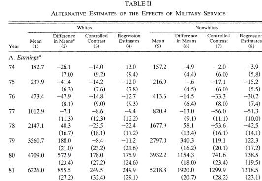
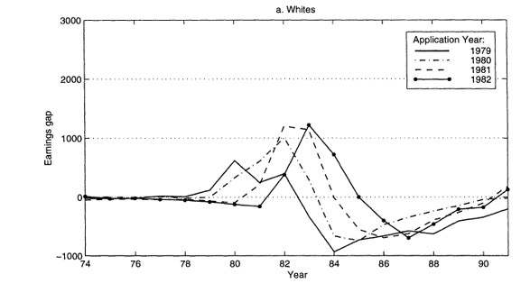

class: title-slide

```{r setup, include=FALSE}
knitr::opts_chunk$set(echo = FALSE, fig.path = "figures/")

library(tidyverse)
library(pacman)
library(janitor)
library(sandwich)
#library(nnet)
#library(mlogit)
library(readr)
library(clubSandwich)
library(modelsummary)
library(estimatr)
library(lubridate)
library(ExPanDaR) #for describing panel data
library(lfe)

p_load(tidyverse, foreign, reshape2, psych, qwraps2, forcats, readxl, 
       broom, lmtest, margins, plm, rdrobust, multiwayvcov,
       wesanderson, sandwich, stargazer,
       readstata13, pscore, optmatch, kdensity, MatchIt, bootstrap, matlib, dplyr)

xfun::pkg_load2(c('base64enc', 'htmltools', 'mime'))
```

```{css, echo = FALSE}
.huge .remark-code { /*Change made here*/
  font-size: 200% !important;
}
.tiny .remark-code { /*Change made here*/
  font-size: 60% !important;
}
```

.title[
# Sesión 15. Métodos de pareamiento
]
.subtitle[
## Evaluación de Programas Sociales
]
.author[
### Irvin Rojas <br> [rojasirvin.com](https://www.rojasirvin.com/) <br> [<i class="fab fa-github"></i>](https://github.com/rojasirvin) [<i class="fab fa-twitter"></i>](https://twitter.com/RojasIrvin) [<i class="ai ai-google-scholar"></i>](https://scholar.google.com/citations?user=FUwdSTMAAAAJ&hl=en)
]

.affiliation[
### Centro de Investigación y Docencia Económicas <br> División de Economía
]

---
# Motivación
 
- Se considera la evaluación aleatoria como el *gold standard* de los métodos de evaluación
  
- Bajo una aleatorización correcta de los tratamientos, las diferencias entre los grupos de tratamiento y control son atribuibles al tratamiento
  
- Sin embargo, existen razones por las cuales es imposible llevar a cabo una asignación aleatoria
  
- ¿Nos conformamos con no poder decir nada?
    
- Podemos usar métodos no experimentales que recaen sobre diversos supuestos para hacer inferencia sobre la efectividad del tratamiento
  
---

class: inverse, middle, center

# El modelo de evaluación

---

# Resultados contrafactuales
 
- Queremos evaluar el efecto de una política, programa o intervención
  
- Tenemos $i=1,...,N$ individuos
  
- Denotamos $Y(D_i)$ a la variable de resultados del individuo $i$ que depende del estado de tratamiento que recibió $D_i$
    
- El efecto del tratamiento para $i$ es:

$$
\tau_i=Y_i(1)-Y_i(0)
$$
  
- Solo vemos a $i$ en un estado de tratamiento
 
---

# Parámetros de interés

$$
ATE=E(Y(1)-Y(0))
$$

- ¿Cuál es el efecto esperado del tratamiento si tomamos un individuo al azar de la *población*?
    
$$
\begin{aligned}
TOT&=E(Y(1)-Y(0)|D=1) \\
&=E(Y(1)|D=1)-E(Y(0)|D=1)
\end{aligned}
$$
  
- El efecto del tratamiento en aquellos que participaron en este
  
- Pero la segunda parte de la definición de $TOT$ no es observable
  
- ¿Qué pasa si nos fijáramos en $(Y(0)|D=0)$, la variable de resultados de los no tratados?

---

# Sesgo de selección
 
- Las razones que deteriminan la asignación del tratamiento determinen también el valor de $Y$
    
$$
\begin{aligned}
E(Y(1)|D=1)&-E(Y(0)|D=1)=\\
=&TOT+E(Y(0)|D=1)-E(Y(0)|D=0)
\end{aligned}
$$

- La diferencia $E(Y(0)|D=1)-E(Y(0)|D=0)$ es el **sesgo de selección**
  
- Es decir, la diferencia en resultados entre tratados y no tratados nos da el $TOT$ solo si el sesgo de selección es cero
  
- Una forma de eliminar el sesgo de selección es mediante la asignación aleatoria del tratamiento
  
- Esto no siempre es posible por lo que recurrimos a supuestos para eliminar el sesgo de selección
 
---
  

# Supuestos de identificación del TOT
 
- **Supuesto 1. Inconfundibilidad**
  
$$
Y(0), Y(1) \perp  D|X
$$

  
- Dado un conjunto de variables $X$, los resultados potenciales son independientes del tratamiento
  
- $X$ debe incluir todas las variables que determinan el tratamiento y los resultados potenciales
  
- **Supuesto 2: Traslape**
  
$$
0< P(D=1|X) < 1
$$

- $X$ no predice $D$ perfectamente
  
- Personas con el mismo $X$ tienen probabilidad positiva de ser tratados y no tratados

---
 
# Supuestos de identificación del TOT
 
- En la literatura, **Supuesto 1** $+$ **Supuesto 2** se conoce como **ignorabilidad fuerte**
  
- Heckman (1998) muestra que estás condiciones son demasiado estrictas
  
- Para identificar el $TOT$ es suficiente:
    
- **Supuesto 1a. Inconfundibilidad en los controles**

$$
Y(0) \perp  D|X
$$

- **Supuesto 2a. Traslape débil**

$$
P(D=1|X) < 1
$$

---

class: inverse, middle, center

# Matching exacto

---

# Matching exacto
 
- Un estimador de matching exacto consiste en  individuos tratados y no tratados para cada valor específico de las $X$ y luego tomar el promedio de las diferencias con los pesos apropiados
  
- Tenemos datos observacionales de individuos que recibieron y no recibieron un tratamiento
  
- Tenemos una serie de características discretizadas en $X_i$
    
- $X_i$ incluye, por ejemplo, raza, año de solicitud de ingreso al programa, escolaridad, calificación en examen de aptitud, año de nacimiento (son las características del ejemplo que vermeos más adelante)
  
- Estas características definene *celdas* y dentro de cada celda tenemos tratados y no tratados
 
---

# Efecto del tratamiento con matching exacto
 
- El TOT asumiendo inconfundibilidad:

$$
\begin{aligned}
\delta^M=TOT&=E\left\{ E(y_{1i}|X_i,D_i=1)-E(y_{0i}|X_i,D_i=0)|D_i=1\right\} \\
&=E\left\{\delta_X | D_i=1\right\}
\end{aligned}
$$

- $\delta_X$ es la diferencia de ingresos promedio entre estados de tratamiento para cada valor de $X_i$
    
- Con $X_i$ discreta y con una muestra disponible:

$$
\delta^M=\sum_{x} \delta_x P(X_i=x|D_i=1)
$$
---
  
# Ejemplo: veteranos de guerra en Estados Unidos

- [Angrist (1998)](https://www.jstor.org/stable/2998558), Estimating the Labor Market Impact of Voluntary Military Service Using Social Security Data on Military Applicants

- El tratamiento es haber servido en el ejercito, algo que claramente tiene autoselección

- Se trata de estimar el efecto en el ingreso

- Los autores construyen celdas de acuerdo a las características antes mencionadas

  - Raza, año de solicitud de ingreso al programa, escolaridad, calificación en examen de aptitud, año de nacimiento

---

# Ejemplo: veteranos de guerra en Estados Unidos

.pull-left[
```{r, out.width="100%",fig.align='center'}

```
]

.pull-right[
```{r, out.width="100%",fig.cap='Fuente: Angrist (1998)',fig.align='center'}
knitr::include_graphics("figures/ExactMatching_effects_table_b.jpg")
```
]


---

# Ejemplo: veteranos de guerra en Estados Unidos

- Noten la primera segunda muestra lo que se hubiera concluido si solo se comparan diferencias de medias
    
- Antes de 1980, las diferencias eran muy pequeñas (cero en términos prácticos)
  
- En esta aplicación esta comparación llevaría a conclusiones incorrectas
  
- Además, las diferencias para no-blancos y blancos son distintas
  
- Hay un pico en los afectos alrededor de 1982
  
- En esta aplicación, los resultados por *matching* y regresión son muy parecidos hasta 1984
  
- La conclusión es que existe evidencia de efectos negativos en los ingresos por haber servido en el ejército en los blancos y efectos positivos para los individuos de otras razas

---

# Ejemplo: veteranos de guerra en Estados Unidos

.pull-left[
```{r, out.width="100%",fig.align='center'}

```
]

.pull-right[
```{r, out.width="100%",fig.cap='Fuente: Angrist (1998)',fig.align='center'}
knitr::include_graphics("figures/ExactMatching_effects_graph_b.jpg")
```
]

---

class: middle, inverse, center
  
# El *propensity score*

---

# Matching exacto es impráctico
 
  - En la práctica es difícil manejar problemas en espacios de múltiples dimensiones: **maldición de la dimensionalidad**
 
- El problema de la maldición de la dimensionalidad se exacerba con el tamaño limitado de las bases de datos
 
- Si $X$ tuviera solo indicadores binarios, el número de posibles combinaciones sería $2^s$
   
- Por ejemplo, si solo tuviéramos $X_1=\{\text{hombre}, \text{mujer}\}$, $X_2=\{\text{más que preparatoria}, \text{menos que preparatoria}\}$, $X_3=\{\text{indígena}, \text{no indígena}\}$, tendríamos que hacer ocho comparaciones:
   
  - hombre, más que preparatoria, indígena
  - hombre, más que preparatoria, no indígena
  - ...
  - mujer, menos que preparatoria, no indígena

- Pero Si $X$ incluye muchas variables, algunas tomando muchos valores, esto se vuelve imposible de realizar
  
---

# Teorema del PS (Rosenbaum y Rubin, 1983)
 
- **Corolario 1. Inconfundibilidad dado el propensity score**
 
- El **Supuesto 1** implica:
 
$$
Y(0), Y(1) \perp  D|P(X)
$$
 
donde $P(X)=P(D=1|X)$ es la probabilidad de ser tratado dado un conjunto de covariables $X$, el *propensity score* o PS
  
---
  
# Estimación
 
- Podemos estimar el efecto del tratamiento:
   
$$
TOT^{PSM}=E_{P(X)|D=1} \left\( E(Y(1)|D=1, P(X))-E(Y(0)|D=0,P(X)) \right\)
$$
 
 
- El $TOT$ es la diferencia en la variable de resultados de los tratados y los no tratados pesada por la distribución del PS en los tratados
  
---

# Estimación
 
- Debemos por tanto primero calcular el PS
 
- Se empatan o se hace match de unidades que fueron tratadas con unidades que no lo fueron usando el PS
 
- Se mide la diferencia en la variable de resultados entre estos grupos
 
- Se hace un promedio ponderado de las diferencias
  
---

# Implementación

1. Estimación del PS
 
2. Escoger el algoritmo de matching
 
3. Comprobar la calidad del matching
 
4. Estimar el $TOT$

---

# Especificar el modelo del PS
 
- Se usa un modelo *probit* o *logit*
 
  - **Prueba y error**.   Maximizar la tasa clasificación de tratamientos y controles usando $\bar{P}$, la proporción de tratamientos en la muestra
 
  - **Significancia estadística**.   Usar solo las variables estadísticamente significativas, comenzando con un modelo muy básico
 
  - **Validación cruzada**.   Comenzar con un modelo simple y agregar grupos de variables comparando las que reduzcan el error cuadrático promedio

- El propósito del PS es sobre todo generar balance de las variables en $X$
    
---

# Recomendaciones prácticas
 
- Las características $X$ que determinan la probabilidad de tratamiento deben ser observables
 
- Las variables usadas para calcular el PS no deben haber sido afectadas por el tratamiento
 
- Idealmente usamos variables $X$ pre-intervención
 
- Cuando no hay $X$ pre-intervención, a veces se puede obtener el PS con variables post-intervención siempre y cuando estas no hayan sido afectadas por el tratamieto (pocas veces recomendado)
  
---

# Algoritmos de matching más populares
  
1. Vecino más cercano
 
1. Caliper y radio
 
1. Estratificación
 
1. Kernel y otros métodos no paramétricos
---

# Vecino más cercano
 
- A cada individuo del grupo tratado se le asigna uno del grupo de comparación en términos del PS
 
- Puede hacerse con remplazo o sin remplazo
 
- Puede emplearse también sobremuestreo (*oversampling*), es decir, asignar más de un individuo del grupo de comparación
  
---

# Caliper y radio
 
- El método de vecino más cercano puede generar malos matches si el vecino más cercano está muy lejos en términos del PS
  
- El método de caliper consite en definir una vecindad aceptable de matching (el caliper) y solo los matches dentro de esta vecindad se emplean para calcular el efecto del tratamiento
 
- Una extensión natural de este procedimiento es el método de radio, que consiste en definir un caliper y después hacer el match con más de una unidad de comparación
  
---

# Estratificación
 
- Partir la región de soporte común en bloques de acuerdo al PS
 
- Estimar el efecto de tratamiento dentro de cada bloque
 
- No hay una regla sobre cuántos estratos usar. Se aconsajan generalmente cinco
 
- Un procedimiento para seleccionar el número de estratos y corroborar el balance es:

  1. Partir el rango de soporte común en cinco bloques iguales
 
  1. Mostrar que el PS está balanceado en cada bloque. Si no, partir dicho bloque
 
  1. Una vez que el PS está balanceado, repetir el procedimiento pero para cada variable en $X$
   
  1. Si no se pueden balancer las variables $X$, reestimar el PS con una nueva especificación

  
---

# Kernel y métodos no paramétricos
 
- Los métodos anteriores escogen solo unas cuantas unidades del grupo de comparación 
 
- Podemos escoger usar muchas o incluso todas las observaciones del grupo de comparación y pesarlas apropiadamente
 
- Se reduce la varianza pues usamos más información pero se sacrifica precisión pues se usan observaciones potencialmente muy distantes
 
- Se le otorga más peso a las observaciones más cercanas y menos a las más distantes
  
---


# ¿Qué método usar?
 
- No hay un método claramente superior a todos los demás
 
- Más aún, el desempeño de cada método depende de cada aplicación
 
- La ruta más seguida es usar varios algoritmos y mostrar la robustez de los resultados a esta elección
  
---

# Comprobar empíricamente los supuestos
 
- El parámetro $TOT$ solo se calcula sobre la región de sporte común por lo que se debe verificar el traslape del PS calculado para los tratados y no tratados
 
- Otro de los teoremas de Rosenbaum y Rubin (1983) implica que

$$
X \perp  D|P(X)
$$
 
es decir, que al controlar por el PS, las variables $X$ no deben proveer información sobre $D$
   
- Se recomienda también hacer una prueba de estratificación

  1. Dividir el rango del soporte común en bloques 
 
  1. Hacer una prueba de medias del PS entre grupos dentro de cada bloque
 
  1. Hacer una prueba de medias de cada variable en $X_i$  entre grupos dentro de cada bloque

---

# Ilustración del soporte común

```{r, out.width="70%", fig.cap='Fuente: Gertler et al. (2017)', fig.align='center'}
knitr::include_graphics("figures/Gertler_PSOverlap.png")
```
---

# Definición del $TOT^M$
 
- Sea $i$ un individuo tratado con características $x$
   
- $A_i$ es el conjunto de individuos de comparación para el individuo $i$:
 
$$A_i(x)=\left\{j|x_j \in c(x_i) \right\}$$
 
 
donde $c(x_i)$ es la vecindad de las características de $x_i$
   
- $N_T$ y $N_C$ es el número de individuos tratados y no tratados
 
- $w(i,j)$ es el peso al caso $j$-ésimo en la comparación para el individuo $i$, con $\sum_j w(i,j)=1$
   
- El $TOT$ es:
   
$$TOT^M=\frac{1}{N_T}\sum_{i\in{D=1}}\left(y_{1i}-\sum_j w(i,j) y_{0j}\right)$$
 
  
---

# Distintos estimadores de matching

1. Vecino más cercano:
    $$A_i(p(x))=\left\{p_j | \min_j || p_i - p_j || \right\}$$
1. Radio
     $$A_i(p(x))=\left\{p_j |  || p_i - p_j || <r \right\}$$

1. Estratificación
     $$TOT^M_{E}=\sum_{b=1}^{B}TOT_b \left(\frac{\sum_{i\in I(b)} D_i}{\sum D_i}\right)$$
 
1. Kernel
    $$w(i,j)=\frac{K(p(x_i)-p(x_j))}{\sum_{j=1}^{N_{c_i}}K(p(x_i)-p(x_j))}$$
 
---

# Varianza del estimador $TOT^M$
 
- Nos interesa conocer la precisión de nuestro estimador
 
- Debemos tomar en cuenta que el PS no es observado sino estimado
 
- Se recomienda usar la fórmula para la varianza de Abadie e Imbens (2006)
 
- Esta fórmula se usa con el comando *teffects* en R
 
- Estos autores de hecho recomiendan no usar bootstrap
  
---

class: inverse, middle, center
  
# Implementación del PSM en R
    
---


# Datos no experimentales de una muestra de mujeres
 
- Usamos los datos en *cattaneo_smoking.dta* (Cattaneo, 2010)
 
- Usaremos la variable de tratamiento **mbsmoke** que es un indicador de si la madre fumó durante el embarazo
 
- El 19\% de los mujeres reportaron fumar
 
- Usaremos un subconjunto de las $X$ disponibles
  
---

# Uso de *pscore*
 
- Una mala caracterización de las variables que determinan el tratamiento conduce a un PS con propiedades no deseadas
 
- Recordemos que una característica propiedad deseable del PS es que genere bloques de observaciones con distribuciones iguales de cada una de las $X$ entre los grupos de tratamiento y control
 
- Usamos especificación que caracterice mejor la selección 
 
- Ver el archivo log *balance\textunderscore ps.log*
  
---

# PS *a mano*
 
- En *la antiguedad* el PS se obtenia a mano, siguiendo el siguiente procedimiento
 

  1. Estimar el PS usando un probit o logit
 
  1. Ordenar las observaciones de acuerdo al PS estimado
 
  1. Crear bloques que tengan en promedio el mismo PS entre tratados y no tratados
    - Comenzar con bloques de cinco, probar diferencias de medias y partir los bloques que tengan diferencias, ...
 
  1. Comprobar que cada covariable está balanceado dentro de cada bloque. Si no lo está, partir el bloque
 
  1. Si una covariable no se logra balancear en ninguno de los bloques, comenzar de nuevo en 1. con un nuevo conjunto de $X$ e interacciones

---

# Estimación del $TOT$
 
- Bajo el supuesto de independencia condicional en el PS, podemos estimar el TT
 
- Debemos escoger el método de pareamiento
 
- Cuatro de los métodos más populares implementados en Stata son:
 
  1. Vecino más cercano
  1. Radio
  1. Estratificación
  1. Kernel	
 
- En este ejemplo, estimamos el efecto sobre el peso del bebé al nacer
 
- Dos comandos populares son *psmatch2* y *teffects*
  
---

# Vecino más cercano
 
- El individuo del grupo de comparación es el que tenga el PS más cercano a cada individuo en el grupo tratado
 
- *psmatch2* usa el PS estimado con *pscore*
 
- Podría usarse para estimar directamente el PS, pero la ventaja de *pscore* es que realiza el diagnóstico de balance
 
- Noten que *pscore* no considera que el PS es estimado al calcular los errores estándar
 
- *pscore* en cambio provee los errores estándar correctos (Abadie e Imbens, 2006)
 
- No se recomienda usar bootstrap en este caso
  
---

# Comparación entre *psmatch2* y *teffects*
 
- Para obtener los mismos resultados con estos dos comandos en *psmatch2* debemos especificar *ties*
 
- Esto indica que cuando hay un empate de observaciones con el mismo PS en el grupo de comparación, se usen todas las observaciones empatadas
 
- *teffects* automáticamente conserva los empates
  
---


# Radio y caliper
 
- Con *caliper* nos referimos a una distancia máxima en términos del PS para hacer un pareamiento
 
- Podríamos imponer un caliper al vecino más cercano para que solo puedan hacerse pareamientos con PS que sean suficientemente parecidos
 
- A priori es difícil saber cuál es el *caliper* rasonable
 
- Una extensión natural es incluir todas las observaciones dentro del radio que define el *caliper*
 
- Se reduce de esta forma el sesgo pero es posible que algunas unidades no puedan ser pareadas
  
---

# Próxima sesión

- Veremos ejemplos típicos de PSM

 + Becerril, J., & Abdulai, A. (2010). The impact of improved maize varieties on poverty in Mexico: a propensity score-matching approach. *World development*, 38(7), 1024-1035.

  + Espinosa, V., & Rubin, D. B. (2015). Did the military interventions in the Mexican drug war increase violence?. *The American Statistician*, 69(1), 17-27.

---

class: center, middle

Presentación creada usando el paquete [**xaringan**](https://github.com/yihui/xaringan) en R.

El *chakra* viene de [remark.js](https://remarkjs.com), [**knitr**](http://yihui.org/knitr), y [R Markdown](https://rmarkdown.rstudio.com).

Material de clase en versión preliminar.

**No reproducir, no distribuir, no citar.**


