class: title-slide

```{r setup, include=FALSE}
knitr::opts_chunk$set(echo = FALSE, fig.path = "figures/")

library(tidyverse)
library(pacman)
library(janitor)
library(sandwich)
#library(nnet)
#library(mlogit)
library(readr)
library(clubSandwich)
library(modelsummary)
library(estimatr)
library(lubridate)
library(ExPanDaR) #for describing panel data
library(lfe)
library(modelsummary)
library(estimatr)
library(Matching)
library(MatchIt)
library(Zelig)

p_load(tidyverse, foreign, reshape2, psych, qwraps2, forcats, readxl, 
       broom, lmtest, margins, plm, rdrobust, multiwayvcov,
       wesanderson, sandwich, stargazer,
       readstata13, pscore, optmatch, kdensity, MatchIt, bootstrap, matlib, dplyr)

xfun::pkg_load2(c('base64enc', 'htmltools', 'mime'))
```

```{css, echo = FALSE}
.huge .remark-code { /*Change made here*/
  font-size: 200% !important;
}
.tiny .remark-code { /*Change made here*/
  font-size: 60% !important;
}

```

.title[
# Sesión 19. Regresión discontinua geográfica
]
.subtitle[
## Evaluación de Programas Sociales
]
.author[
### Irvin Rojas <br> [rojasirvin.com](https://www.rojasirvin.com/) <br> [<i class="fab fa-github"></i>](https://github.com/rojasirvin) [<i class="fab fa-twitter"></i>](https://twitter.com/RojasIrvin) [<i class="ai ai-google-scholar"></i>](https://scholar.google.com/citations?user=FUwdSTMAAAAJ&hl=en)
]

.affiliation[
### Centro de Investigación y Docencia Económicas <br> División de Economía
]

---


---

class: inverse, middle, center

# Discontinuidades geográficas

---
 
# Introducción a discontinuidades geográficas (GRD)

- Situaciones donde una unidad administrativa es tratada y la adyacente no lo es

- ¿Cómo explotar apropiadamente la distancia a la frontera?

- Quizás el estudio de Card y Krueger (1994) sobre el salario mínimo podría haberse abordado como un GRD

- Popularmente usado en comportamiento electoral

- Ejemplo: áreas de mercados desginados (DMA) que abarcan condados en más de un estado en EUA

- ¿Cuál es el efecto de recibir propaganda electoral en la participación en la elección?
 

---

# Notación
 
- Areas tratadas y no tratadas: $\mathcal{A}^t$ y $\mathcal{A}^c$

- $T_i=1$ indica una unidad en el área tratada (DMA de Filadelfia)

- $T_i=0$ indica una unidad en el área no tratada (DMA de Nueva York)

- $S_i=(S_{i1},S_{i2})$ es la localización de una unidad

- $b=(S_{1},S_{2})\in \mathcal{B}$ es un punto en la frontera


---


# Efecto de tratamiento

- $\tau(b)\equiv E\{Y_{i1}-Y_{i0}|S_i=b\}$ para todo $b \in \mathcal{B}$ 

- Hay un efecto de tratamiento para cada uno de los puntos $b$ en la frontera, definiendo una *curva de efectos de tratamiento*

- Un objeto de interés podría ser el promedio de efectos a lo largo de la frontera $\tau=E\{Y_{i1}-Y_{i0}|S_i=b\}$
 
---

# Tratamientos counfundidos

- Muchas veces los límites administrativos hacen que haya más de un tratamiento cambiando en la discontinuidad

- En este ejemplo, casi siempre los DMA son conglomerados de condados, así que las fronteras coinciden

- Muchos aspectos electorales se deciden a nivel condado, por lo tanto hay tratamientos confundidos

- Debemos asumir que no hay efecto condado o, en su defecto, que estamos estimando el efecto condado y el efecto DMA

- O podemos seguir una estrategia tipo DID, donde podemos ver a las unidades antes y después que la discontinuidad de interés ocurra
 
---

# Frontera El Dorado y Reno

- Otra opción es identificar zonas donde el mismo condado sea partido por una DMA

- Esto pasa en la región de El Dorado y Reno, en California

```{r, out.width="45%",fig.cap='Fuente: Keele & Titiunik (2016)',fig.align='center'}
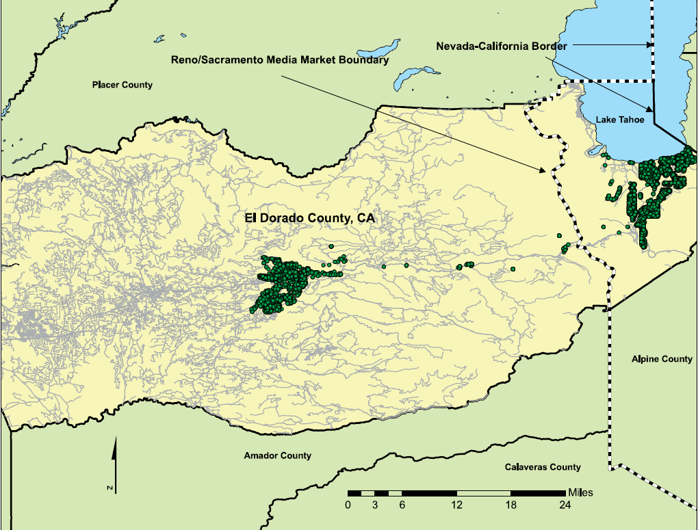
``` 
 
---

# Problemas

- No hay suficientes observaciones para hacer creíble la GRD

- Hay diferencias sustanciales en, por ejemplo, precio de las casas

- Reno es considerablemente más rico
 
---

# ¿Cómo usar la distancia?

.pull-left[
- Distancia ingenuna: distancia más corta de cada punto a la frontera

- No es útil pues esto no nos informa la localización geográfica de los puntos
]


.pull-right[
```{r, out.width="60%",fig.cap='Fuente: Keele & Titiunik (2016)',fig.align='center'}
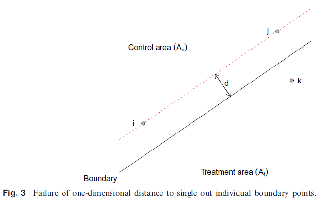
```
]

---

# ¿Cómo usar la distancia?

- **Distancia geográfica**: para cada punto $b$ de la frontera, calculamos la [distancia euclideana](https://es.wikipedia.org/wiki/Distancia_euclidiana) entre cada punto $S_i$ y $b$, $f_b(S_i)$

- De manera análoga a la RD en una dimensión, definimos la función de regresión de la variable de resultados de interés para tratados y no tratados como

$$
\begin{aligned}
\mu(b)^C&=lim_{s^C\to b}E(Y_{i0}|f_b(S_i)=f_b(s^c))\\
\mu(b)^T&=lim_{s^T\to b}E(Y_{i1}|f_b(S_i)=f_b(s^T))
\end{aligned}
$$
--

- La función de esperanza condicional de la variable de interés puede ser estimada con una regresión local:

$$\hat{\beta}=\arg\min_{\beta}\sum_{i=1}^N\left(Y_i -\sum_{j=0}^p\beta_j(X_i-x_o)^j \right)^2w_i$$
donde $w_i$ son los pesos de una función Kernel con ancho de banda $h$ tal que $w_i=\frac{1}{h}K\left(\frac{X_i-x_0}{h}\right)$

- Para un punto en la frontera, es decir, $X=x_0$, la esperanza de la variable de interés es simplemente $\hat{\beta}_0$


---

# Efecto GRD

- $\hat{\tau}=\hat{\mu}^t(b)-\hat{\mu}^c(b)=\hat{\alpha}^t_b-\hat{\alpha}^c_b$

- Queremos estimar las funciones de esperanza de $Y_{i0}$ y $Y_{i1}$ condicionales a la distancia

  
$$
\begin{aligned}
(\hat{\alpha}^c_b,\hat{\beta}^c_b)=\arg \min_{\alpha^c_b,\beta^c_b}\sum_{i\in\mathcal{A}^c}\left\{Y_i -\alpha_b^c-\beta_b^c f_b(S_i) \right\}^2 w_{ib} \\
(\hat{\alpha}^t_b,\hat{\beta}^t_b)=\arg \min_{\alpha^t_b,\beta^t_b}\sum_{i\in\mathcal{A}^t}\left\{Y_i -\alpha_b^t-\beta_b^t f_b(S_i) \right\}^2 w_{ib}
\end{aligned}
$$
  

con pesos $w_{ib}=\frac{1}{h_b}K\left(\frac{f_b(S_i)}{h_b}\right)$

- Agregamos: $\hat{\tau}(b)=(\sum_{g=1}^{G}\hat{\tau}(b^g)\hat{f}(b^g))/(\sum_{g=1}^{G}\hat{f}(b^g))$
	 
 
---

# Pruebas de falsificación

- Usar el método descrito anteriormente para mostrar que variables pre tratamiento no varían en la discontinuidad

- Prueba de balance:
 
  - Calcular distancia de $i$ a todos los no tratados
  - Encontrar el vecino más cercano
  - Aplicar una prueba $t$ a la muestra pareada
  

---

# Efecto de los anuncios en la votación

- Datos del registro electoral y de ventas de casas

- Se pudieron georeferenciar a todos los individuos en el registro

- Se identificó una región donde solo cambia la DMA


---

# Efecto de los anuncios en la votación

```{r, out.width="60%",fig.cap='Fuente: Keele & Titiunik (2016)',fig.align='center'}
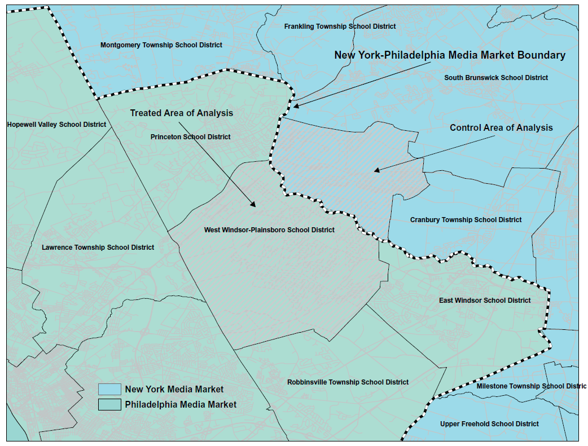
``` 
 
---

# Efecto de los anuncios en la votación

```{r, out.width="95%",fig.cap='Fuente: Keele & Titiunik (2016)',fig.align='center'}
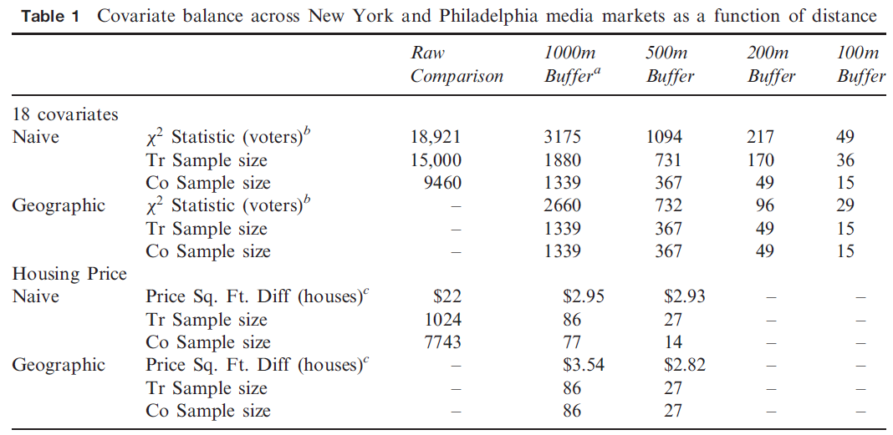
``` 

---

# Efecto de los anuncios en la votación

```{r, out.width="60%",fig.cap='Fuente: Keele & Titiunik (2016)',fig.align='center'}
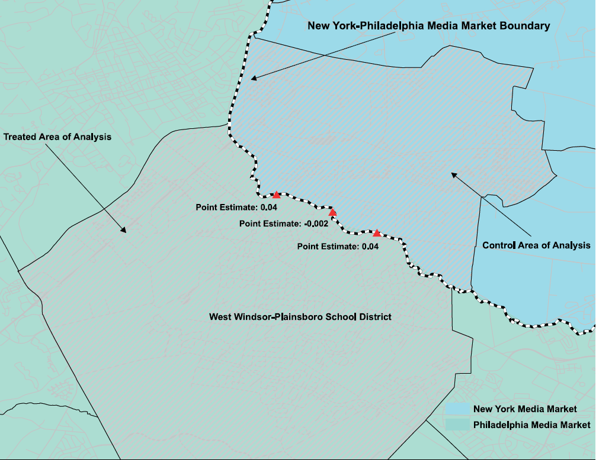
``` 

---

# Efecto de los anuncios en la votación

```{r, out.width="60%",fig.cap='Fuente: Keele & Titiunik (2016)',fig.align='center'}
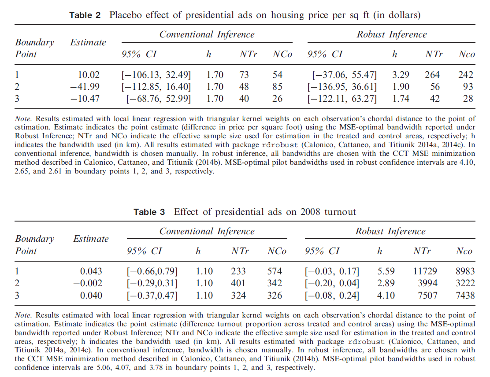
``` 

---

class: inverse, middle, center

# Matching y discontinuidades geográficas

---

# Matching con covariables

.pull-left[
- Mejorar la comparabilidad entre unidades tratadas y no tratadas

- Iniciativa en Milwaukee para otorgar un día libre por enfermedad por cada 30 días trabajados

- Se votó esta inciativa solo en la zona de la ciudad (amarilla)

- Datos del registro de votantes de Milwaukee

- Precio de venta de casas
]

.pull-right[
```{r, out.width="70%",fig.cap='Fuente: Keele, Titiunik & Zubizarreta (2015)',fig.align='center'}
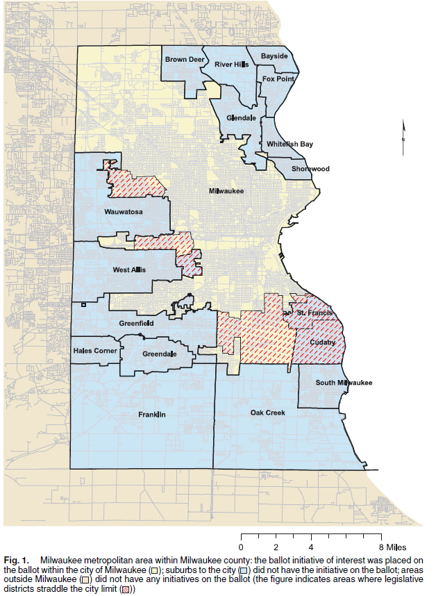
```
]


---

# Diseño 1: condicionar en observables

- Los resultados potenciales $Y_{T,j}$ y $Y_{C,j}$ son independientes del tratamiento condicional en covariables $X_j$

- $X_j$ no incluye medidas de distancia hacia la frontera entre $A_C$ y $A_T$

- Problema: hay no observables que pueden determinar dónde elige vivir la gente (ciudad vs suburbios)

---

# Diseño 2: GRD

- Estimación del efecto de tratamiento como en Keele y Titiunik (2015)

---
 
# Diseño 3: GRD + condicionar en observables

.pull-left[
- Puede haber selección alrededor de la frontera

- Podemos asumir que una vez controlando por covariables, el tratamiento es como si fuera aleatorio cerca de los límites

- Se asume que existe $N(b_1,b_2)$, una vecindad alrededor de $(b_1,b_2)$ en la frontera, donde los resultados potenciales son independientes del tratamiento condicionados en $X_j$
]

.pull-right[
```{r, out.width="100%",fig.cap='Fuente: Keele, Titiunik & Zubizarreta (2015)',fig.align='center'}
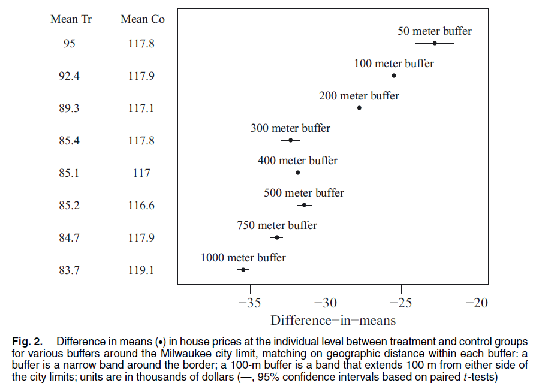
```
]

---

# Matching usando programación entera

- Método que puede ser incluso usado con RD típica

- Hay varios tipos de covariables:

  - Covariables discretos clave a los que queremos hacer match exacto (mismo distrito estatal, senado y congreso, sexo, historial de voto 2004 - 2006)
  - Otros menos importantes a los que basta con balancear las algunos momentos (precios de casas)
  - Y otros aún menos importantes a los que basta con balancear las medias (edad)

- Se plantea un algoritmo para determinar quién es pareado con quién, minimizando la distancia e imponiendo restricciones en la distribución fina que se desea parear y en igualdad de medias
	 
 


---

# Matching usando programación entera


```{r, out.width="58%",fig.cap='Fuente: Keele, Titiunik & Zubizarreta (2015)',fig.align='center'}
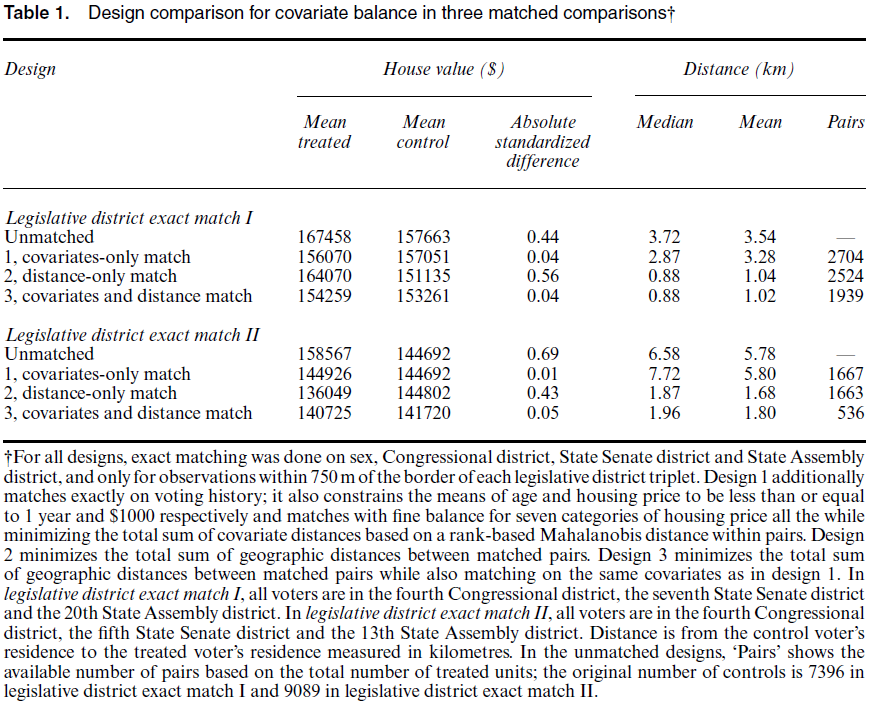
``` 

---

# Matching usando programación entera

```{r, out.width="60%",fig.cap='Fuente: Keele, Titiunik & Zubizarreta (2015)',fig.align='center'}
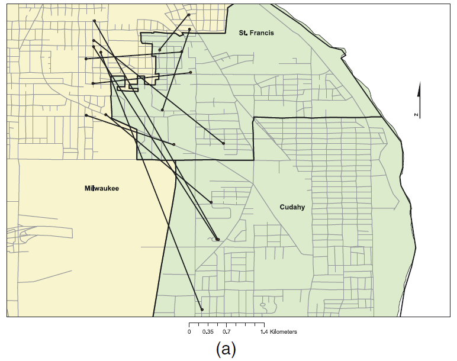
```

---

# Matching usando programación entera

```{r, out.width="55%",fig.cap='Fuente: Keele, Titiunik & Zubizarreta (2015)',fig.align='center'}
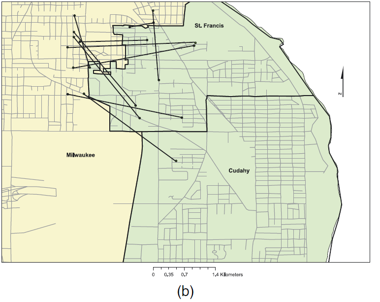
```
---

# Matching usando programación entera

```{r, out.width="55%",fig.cap='Fuente: Keele, Titiunik & Zubizarreta (2015)',fig.align='center'}

```

---

# Matching usando programación entera

```{r, out.width="55%",fig.cap='Fuente: Keele, Titiunik & Zubizarreta (2015)',fig.align='center'}
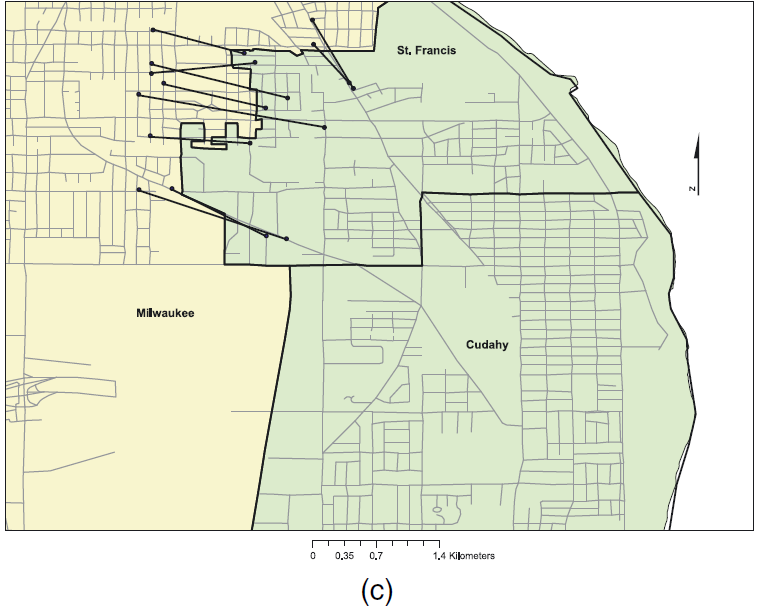
```

---

# Estimación de los efectos

- Efecto de la presencia de inciativa en la boleta en la participación

- Se emplea un esquema de inferencia por aleatorización (randomization inference)

- Tenemos $I$ parejas

- $\delta_{ij}={-1,0,1}$ son los posibles valores de la diferencia de resultados (votar o no votar) para cada pareja
- Contar el número de eventos donde los tratados votan y los no tratados no votan, $T$

---

# Estimación de los efectos

- Generamos una distribución empírica $T_C$, que representa el número de votos que hubieran ocurrido sin tratamiento
- Probar $H0: \delta=0$

- Dado que hacemos correción por matching, usamos una distribución tal que $\frac{1}{1+\Gamma}\leq P(Z_{ij}=1|X_j)\leq \frac{\Gamma}{1+\Gamma}$

- $\Gamma$ ajusta el sesgo que debería existir debido a no observables para modificar las conclusiones basadas en independencia condicional
	 
---

# Estimación de los efectos

```{r, out.width="60%",fig.cap='Fuente: Keele, Titiunik & Zubizarreta (2015)',fig.align='center'}
knitr::include_graphics("figures/GRDvoting_patterns.png")
```

---

# Complicaciones
	 
- Discontinuidad determina intensidad o probabilidad de tratamiento $\rightarrow$ regresión discontinua difusa

- Si la discontinuidad surge en el espacio, por ejemplo, por una frontera geográfica podemos incorporar la distancia como la variable de selección y hacer un GRD

- Se usan métodos de geolocalización para determinar qué unidades serán comparadas

- Es posible introducir covariables para refinar los grupos de comparación

- El uso de covariables puede usarse en GRD o en simple RD

---

# Próxima sesión

- Veremos un ejemplo aplicado

  - Davis, L. W. (2008). The effect of driving restrictions on air quality in Mexico City. *Journal of Political Economy*, 116(1), 38-81.  

- Veremos aplicaciones de RD en R

---

class: center, middle

Presentación creada usando el paquete [**xaringan**](https://github.com/yihui/xaringan) en R.

El *chakra* viene de [remark.js](https://remarkjs.com), [**knitr**](http://yihui.org/knitr), y [R Markdown](https://rmarkdown.rstudio.com).

Material de clase en versión preliminar.

**No reproducir, no distribuir, no citar.**


