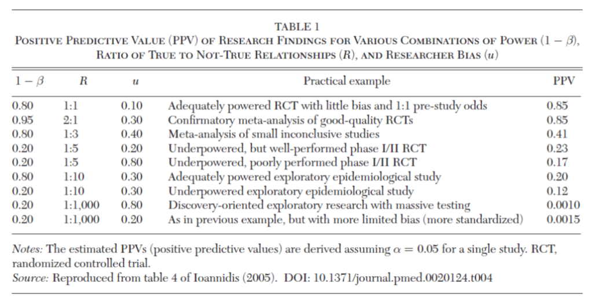
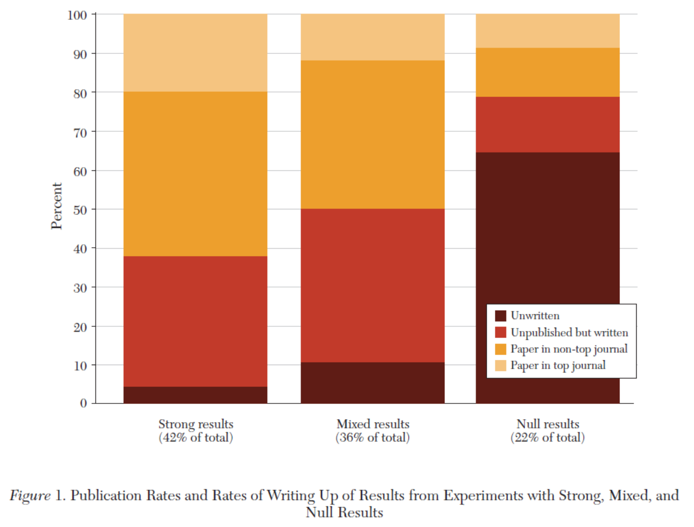
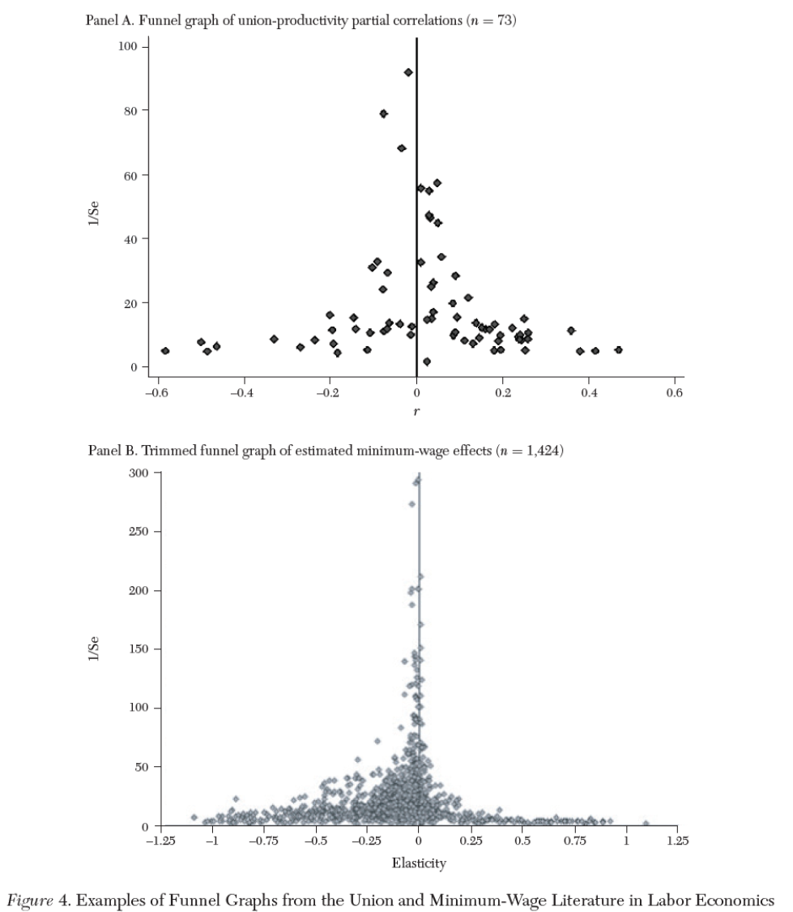
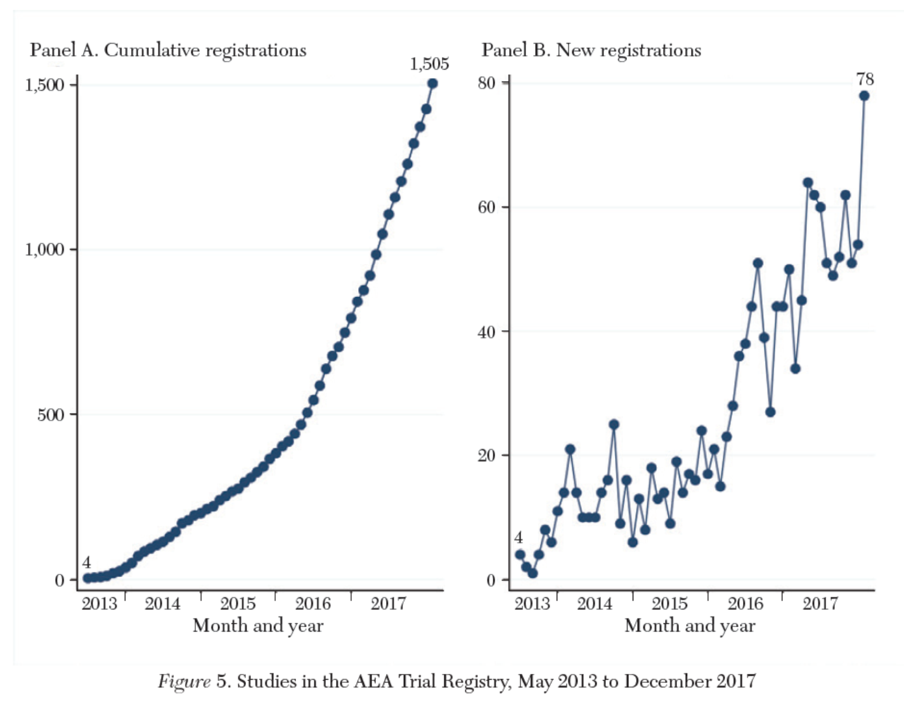

class: title-slide

```{r setup, include=FALSE}
knitr::opts_chunk$set(echo = FALSE, fig.path = "figures/")

library(tidyverse)
library(pacman)
library(janitor)
library(sandwich)
#library(nnet)
#library(mlogit)
library(readr)
library(clubSandwich)
library(modelsummary)
library(estimatr)
library(lubridate)
library(ExPanDaR) #for describing panel data
library(lfe)
library(modelsummary)
library(estimatr)
#library(Matching)
#library(MatchIt)
#library(Zelig)
library(gtsummary)
library(miceadds)
library(stargazer)
library(Synth)
library(reshape2)

p_load(tidyverse, foreign, reshape2, psych, qwraps2, forcats, readxl, 
       broom, lmtest, margins, plm, rdrobust, multiwayvcov,
       wesanderson, sandwich, stargazer,
       readstata13, pscore, optmatch, kdensity, MatchIt, bootstrap, matlib, dplyr)

xfun::pkg_load2(c('base64enc', 'htmltools', 'mime'))
```

```{css, echo = FALSE}
.huge .remark-code { /*Change made here*/
  font-size: 200% !important;
}
.tiny .remark-code { /*Change made here*/
  font-size: 60% !important;
}
```

.title[
# Sesión 25. Cientificidad y ética
]
.subtitle[
## Evaluación de Programas Sociales
]
.author[
### Irvin Rojas <br> [rojasirvin.com](https://www.rojasirvin.com/) <br> [<i class="fab fa-github"></i>](https://github.com/rojasirvin) [<i class="fab fa-twitter"></i>](https://twitter.com/RojasIrvin) [<i class="ai ai-google-scholar"></i>](https://scholar.google.com/citations?user=FUwdSTMAAAAJ&hl=en)
]

.affiliation[
### Centro de Investigación y Docencia Económicas <br> División de Economía
]

---

class: inverse, middle, center

# Transparencia, reproductibilidad y credibilidad

---

# ¿Qué tan creíbles son los resultados que vemos en los artículos?

- Ioannidis (2005) define el *valor predictivo positivo* (PPV) como la probabilidad de que una relación encontrada sea cierta

- Sea $R_i$ la razón de hipótesis verdaderas a hipótesis no verdaderas en una rama de la ciencia

$$PPV_i=\frac{(1-\beta)R_i}{(1-\beta)R_i+\alpha}$$
 
--
 
- Cuando hacemos investigación tomamos muchas decisiones
 
- Nivel de significancia $\alpha$: probabilidad de cometer error del tipo I (rechazar la H0 cuando esta es verdadera)
 
- Poder $1-\beta$: probabilidad de rechazar la H0 cuando la Ha es verdadera

---

# ¿Qué tan creíbles son los resultados que vemos en los artículos?

$$PPV_i=\frac{(1-\beta)R_i+u_i\beta R_i}{(1-\beta)R_i+\alpha+u_i \beta R_i+u_i(1-\alpha)}$$
 
- Sesgo personal $u_i$: probabilidad de reportar un resultado nulo como significativo
 
---

# ¿Qué tan creíbles son los resultados que vemos en los artículos?

- Con algunos valores
  - $\alpha=0.05$
  - $\beta=0.80$
  - Con la mitad de las hipótesis ciertas
  
entonces $PPV_i=0.94$

- Con sesgo del autor bajo (10%), $PPV=0.79$
---

# ¿Qué tan creíbles son los resultados que vemos en los artículos?

```{r, out.width="70%",fig.cap='Fuente: Christensen & Miguel (2018)',fig.align='center'}

```

---

# Sesgo de publicación

.pull-left[
- Ciertos tipos de resultados tienen mayor probabilidad de ser publicados que otros

- No rechazar la $H_0$ también es investigación

- *Problema del archivero*

- Brodeur et al. (2016) distribución de estadísticos $t$ con *bonches* alrededor de 0.05

- En economía, por ejemplo

  - Salario mínimo
  
  - Valor de una vida estadística (VSL)

]

.pull-right[
```{r, out.width="100%",fig.cap='Fuente: Christensen & Miguel (2018)',fig.align='center'}

```
]

---

# Búsqueda de la especificación *preferida*

- Papel del poder de cómputo

- Lemer (1983) muestra cómo un resultado puede tener cualquier signo

- Leamer es crítico de la libertad que los econometristas tienen para analizar los datos

- Crítica al uso de valores $p$

- Análisis de subgrupos


---

# Replicabilidad

- Accesibilidad a los datos problemática

- Revistas comienzan a implementar políticas de proveer datos

- *Psycology Science* usa sellos para certificar datos abiertos e hipotesis pre-registradas

- Privacidad y propiedad de los datos

- *Parásitos de datos*

- *American Journal of Political Science* comisiona replicación a un tercero

- Ejemplos de éxito y fracaso *replicando* estudios


---

# Replicabilidad

- Taxonomía

  1. Verificación o replicación pura
  
  1. Reproducción o replicación estadística
  
  1. Reanálisis
  
  1. Extensión
  
---

# Nuevos métodos y herramientas

.pull-left[
- Diseño

- Incertidumbre en los modelos

  - Recomiendo este reciente trabajo

  - Meager, R. (2019). Understanding the average impact of microcredit expansions: A Bayesian hierarchical analysis of seven randomized experiments. American Economic Journal: Applied Economics, 11(1), 57-91.

  - Una reseña [acá](https://voxdev.org/topic/methods-measurement/understanding-average-effect-microcredit)

- Curvas de especificación
]

.pull-right[


.center[Fuente: [Rohrer (2018)](https://www.psychologicalscience.org/observer/run-all-the-models-dealing-with-data-analytic-flexibility)]
]


---

# Nuevos métodos y herramientas

.pull-left[
- Pruebas de sesgo de publicación
]

.pull-right[
```{r, out.width="70%",fig.cap='Fuente: Christensen & Miguel (2018)',fig.align='center'}

```
]

---


# Nuevos métodos y herramientas

.pull-left[
- Registro de estudios

- Planes pre-análisis

  - Acá [un ejemplo](https://www.socialscienceregistry.org/trials/721/history/4332)
  
- Datos abiertos

- Aspectos computacionales
]

.pull-right[
```{r, out.width="70%",fig.cap='Fuente: Christensen & Miguel (2018)',fig.align='center'}

```
]


---

class: inverse, middle, center

# Ética e integridad

---

# Dimensión ética de la aleatorización

- Papel del *engaño* (*deceptio*)

  - ¿Qué es?
  - Ejemplos
  - Consecuencias
  
- ¿El engaño viola el respeto por la autonomía?

- ¿Qué pasaría sin este engaño?


> *"Un participante no habría elegido participar si se le hubiera informado apropiadamente sobre la naturaleza del experimento y las prácticas engañosas que involucra."*
>
> --- Lewies (2020)

---

# Dimensión ética de la aleatorización


- ¿Cómo justificamos el negar potenciales beneficios a individuos elegibles?

- Aleatorización como forma de justicia

- ¿La aleatorización es éticamente neutral?

- Diferencias entre experimentos en laboratorio en ciencias naturales y la experimentación en ciencias sociales


---

# Dimensión ética de la aleatorización

- [**Equilibrio clínico**](https://www.ncbi.nlm.nih.gov/pmc/articles/PMC3172958/#:~:text=Clinical%20equipoise%20is%20the%20assumption,two%20or%20more%20care%20options.) (*clinical equipoise*) es el supuesto de que no hay *mejor* intervención disponible durante el diseño de un RCT

- Existe equilibrio clínico cuando no hay bases para elegir entre opciones

- También se conoce como *hipótesis nula honesta*

- **Equilibrio personal** sucede quien provee el tratamiento no tiene preferencias y realmente desconoce los beneficios o daños que representa el tratamiento


---

# Caminos causales

- Teoría de la causalidad *intervencionista*
  - No inteferencia
  - Grupos tratadas y no tratados idénticos
  
- ¿La aleatorización garantiza que se cumpla la teoría?

- Ensayos repetidos

- ¿La búsqueda de un diseño integro justifica la aleatorización?

---

# Confiabilidad y validez del diseño

- Validez interna y validez externa

- Diferencias entre los experimentos en laboratorio y los experimentos en ciencias sociales

- ¿Los RCT tiene validez externa porque se realizan en el *mundo real*?

- Tensión entre la validez interna y externa

- ¿Qué busca una *política basada en evidencia*?

- ¿La aleatorización garantiza la validez externa?

- ¿Cómo contribuyen otras formas de investigación a la validez externa?


---

# Próxima sesión

- Hablaremos sobre modelos estructurales

- Low, H., & Meghir, C. (2017). The use of structural models in econometrics. *Journal of Economic Perspectives*, 31(2), 33-58.

- Attanasio, O. P., Meghir, C., & Santiago, A. (2011). Education choices in Mexico: using a structural model and a randomized experiment to evaluate Progresa. *The Review of Economic Studies*, 79(1), 37-66.


---

class: center, middle

Presentación creada usando el paquete [**xaringan**](https://github.com/yihui/xaringan) en R.

El *chakra* viene de [remark.js](https://remarkjs.com), [**knitr**](http://yihui.org/knitr), y [R Markdown](https://rmarkdown.rstudio.com).

Material de clase en versión preliminar.

**No reproducir, no distribuir, no citar.**


