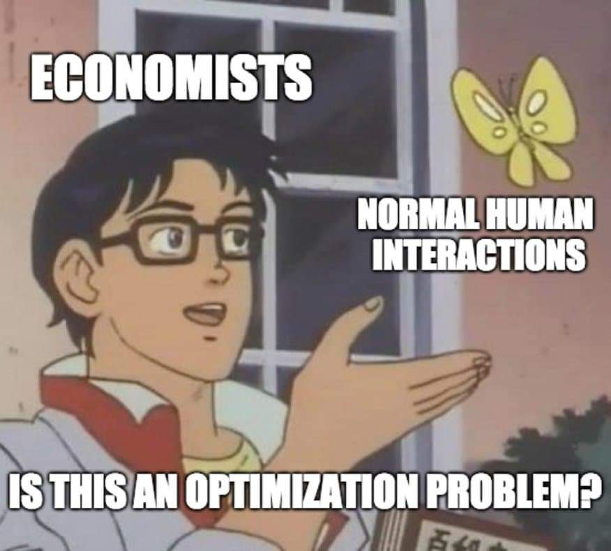

class: title-slide

```{r setup, include=FALSE}
knitr::opts_chunk$set(echo = FALSE, fig.path = "figures/")

library(tidyverse)
library(pacman)
library(janitor)
library(sandwich)
#library(nnet)
#library(mlogit)
library(readr)
library(clubSandwich)
library(modelsummary)
library(estimatr)
library(lubridate)
library(ExPanDaR) #for describing panel data
library(lfe)
library(modelsummary)
library(estimatr)
#library(Matching)
#library(MatchIt)
#library(Zelig)
library(gtsummary)
library(miceadds)
library(stargazer)
library(Synth)
library(reshape2)

p_load(tidyverse, foreign, reshape2, psych, qwraps2, forcats, readxl, 
       broom, lmtest, margins, plm, rdrobust, multiwayvcov,
       wesanderson, sandwich, stargazer,
       readstata13, pscore, optmatch, kdensity, MatchIt, bootstrap, matlib, dplyr)

xfun::pkg_load2(c('base64enc', 'htmltools', 'mime'))
```

```{css, echo = FALSE}
.huge .remark-code { /*Change made here*/
  font-size: 200% !important;
}
.tiny .remark-code { /*Change made here*/
  font-size: 60% !important;
}
```

.title[
# Sesión 26. Modelos estructurales
]
.subtitle[
## Evaluación de Programas Sociales
]
.author[
### Irvin Rojas <br> [rojasirvin.com](https://www.rojasirvin.com/) <br> [<i class="fab fa-github"></i>](https://github.com/rojasirvin) [<i class="fab fa-twitter"></i>](https://twitter.com/RojasIrvin) [<i class="ai ai-google-scholar"></i>](https://scholar.google.com/citations?user=FUwdSTMAAAAJ&hl=en)
]

.affiliation[
### Centro de Investigación y Docencia Económicas <br> División de Economía
]

---

class: inverse, middle, center

# Modelos estructurales

---


# Tipo de modelos usados hasta ahora
 
- Hasta ahora hemos estudiado relaciones de forma reducida
 
- Estudiamos diversos métodos para tratar de identificar el efecto del tratamiento sobre la variable de resultados
 
- Si bien nuestro estudio está guíado por la teoría económica...
 
- ... estos modelos no modelan la toma de decisiones
 
- Los parámetros no tienen interpretación estructural
 
- Los parámetros están *confundidos* por los valores de continuación (como veremos más adelante)
 
- En cambio, los modelos de forma reducida son computacionalmente poco costosos 
 
 
---


# Modelos estructurales
 
- Los modelos estructurales especifican la función objetivo de los agentes
 
- La función objetivo se fundamenta en la teoría económica pero se liga a los datos
 
- Las decisiones y los conjuntos de información de los agentes se hacen explícitos
 
- Se definen también las relaciones entre las variables y las preferencias
 
- Son útiles para cuantificar efectos no solo en el corto plazo sino también en el largo plazo
 
- Podemos comparar los resultados de corto plazo con lo que se obtiene de modelos de forma reducida
 
- Perimiten hacer simulaciones
 
 
---

# Modelos estructurales completamente especificados

 
- Definen las funciones objetivo de los actores...
 
... el conjunto de acciones que pueden tomar
 
... las variables que caracterizan el ambiente económico
 
- La solución al modelo caracteriza las acciones óptimas del individuo en función del ambiente
 
- Este tipo de modelos son el pan de cada día en ramas de la economía como la economía industrial o la economía de la energía y los recursos renovables
 
- En economía, su uso se ha vuelto popular solo recientemente en algunas ramas como la economía laboral y el desarrollo económico 
 

---


# Ejemplos notables
 
- ¿Cómo responden maestros en India a un programa de incentivos para que asistan a clase?
   
- ¿Cómo afectó PROGRESA las decisiones de asistencia escolar de los niños que recibieron el programa?
   
- ¿Cómo afecta una reforma al sistema de pensiones en Chile a las decisiones de participación en el mercado laboral y las contribuciones?
   
- ¿Cuáles son los retornos de un programa de microcréditos en Tailandia?
   
 
---

# ¿Qué modelar y qué no?
 
- Un modelo estructural caracteriza las decisiones y el ambiente pero también abstrae el problema de la complejidad del mundo real
 
- Cuando se desarrolla un modelo estructural es común caer en la *tentación* de querer incluir demasiado
 
- Debemos tomar decisiones y excluir algunas decisiones y relaciones
 
- Algunas variables se asumen exógeneas y otras se omiten completamente del análisis
 
- Algunos supuestos simplifican el análisis y otros se usan para identificar el modelo
 
 
---


# Combinación de modelos estructurales con experimentos aleatorios
 
- Hemos estudiado con detalle las bondades de la variación experimental
 
- Este tipo de variación puede explotarse también para estimar modelos estructurales
 
- Pero también el modelo estructural puede servir para validar lo obtenido por métodos experimentales
 
- Veremos un ejemplo muy interesante en el trabajo de Attanasio, Meghir & Santiago (2012) sobre PROGRESA

---

# ¿Qué ganamos y perdemos?

- Entendimiento de los mecanismos

  - Diseño de mejores políticas

- Análisis contrafactuales

--

- Recurrimos a muchos supuestos para darle estructura a los problemas

- Supuestos distribucionales para parámetros de preferencias


---

# Ingredientes
 
- Estructura de las preferencias y mecanismos
 
- **Reglas de decisión**: describen cómo los individuos toman decisiones en respuesta a diferentes realizaciones de las variables de estado
 
- **Variables de estado**: describen el ambiente económico, institucional, natural (exógenas y endógenas)
 
- **Función valor**: mapeo de las decisiones en un valor numérico
 
---

# El concepto de función valor
 
- A cada acción (o conjunto de acciones) se les asocia un valor numérico (la utilidad que implica tomar una decisión) dado un conjunto de variables de estado
 
- Es el nivel de utilidad dada una acción y el valor de las variables de estado
 
- En un problema dinámico la función valor no solo depende de las acciones tomadas hoy sino de las repercusiones que esta decisión tiene para las decisiones futuras
 
 
---

# Estimación de modelos estructurales
 
- La mayoría de los modelos estruturales son en la práctica modelos de optimización no lineales
 
- La estimación de estos modelos es probablemente el costo de entrada más importante
 
- El punto más importante de la estimación es la estimación de funciones valor y las reglas de decisión
 
---


# Métodos de estimación
 
- Máxima verosimilitud
 
- Método de momentos
 
 
---


# Comparación entre modelos
 
- Los modelos estructurales y de forma reducida tienen ambos ventajas y desventajas
 
- Se recomienda usar ambos y describir los resultados obtenidos con distintas metodologías
 
- Los experimentos aleatorios proveen identificación limpia pero son caros y sirven para probar unas cuantas hipótesis
 
- La combinación de modelos estructurales con variación experimental permite emplear estrategias de validación
 
 
---

# Ejemplo: un modelo de asistencia escolar

- Todd y Wolpin (2010) introducen la estructura de los modelos estructurales y diferencian entre modelos estáticos y dinámicos
 
- Los padres tienen incentivos para enviar a sus hijos a la escuela o para que trabajen
 
- Los hogares derivan utilidad del consumo y de la asistencia escolar de los hijos
 
- Los hijos también pueden ganar un salario si no asisten a la escuela, dando lugar a un problema de optimización
 
- ¿Qué variables y mecanismos incluir o no?
   
- ¿Qué tan realistas son los supuestos? Por ejemplo, ¿quién es el tomador de decisiones relevante?
   
---

```{r, out.width="60%",fig.cap='Fuente: Grupo Parlamentario de Twitter',fig.align='center'}

```

---

# Conclusión

- Los modelos estructurales son una forma de combinar la teoría y los datos

- Cuando tenemos variación aleatoria, podemos añadir valor al análisis empírico

- Hay un costo de entrada en términos de las técnicas para resolver y estimar los modelos estructurales

- Hay un trade-off entre complejidad y transparencia

---

# Próxima sesión

- Tendremos una presentación sobre modelos estructurales

  - Attanasio, O. P., Meghir, C., & Santiago, A. (2011). Education choices in Mexico: using a structural model and a randomized experiment to evaluate Progresa. *The Review of Economic Studies*, 79(1), 37-66.

---

class: center, middle

Presentación creada usando el paquete [**xaringan**](https://github.com/yihui/xaringan) en R.

El *chakra* viene de [remark.js](https://remarkjs.com), [**knitr**](http://yihui.org/knitr), y [R Markdown](https://rmarkdown.rstudio.com).

Material de clase en versión preliminar.

**No reproducir, no distribuir, no citar.**


