class: title-slide

```{r setup, include=FALSE}
knitr::opts_chunk$set(echo = FALSE, fig.path = "figures/")

library(tidyverse)
library(pacman)
library(janitor)
library(sandwich)
#library(nnet)
#library(mlogit)
library(readr)
library(clubSandwich)
library(modelsummary)
library(estimatr)
library(lubridate)
library(ExPanDaR) #for describing panel data
library(lfe)
library(modelsummary)
library(estimatr)
#library(Matching)
#library(MatchIt)
#library(Zelig)
library(gtsummary)
library(miceadds)
library(stargazer)
library(Synth)
library(reshape2)

p_load(tidyverse, foreign, reshape2, psych, qwraps2, forcats, readxl, 
       broom, lmtest, margins, plm, rdrobust, multiwayvcov,
       wesanderson, sandwich, stargazer,
       readstata13, pscore, optmatch, kdensity, MatchIt, bootstrap, matlib, dplyr)

xfun::pkg_load2(c('base64enc', 'htmltools', 'mime'))
```

```{css, echo = FALSE}
.huge .remark-code { /*Change made here*/
  font-size: 200% !important;
}
.tiny .remark-code { /*Change made here*/
  font-size: 60% !important;
}
```

.title[
# Sesión 28. Modelos de impactos en economías locales
]
.subtitle[
## Evaluación de Programas Sociales
]
.author[
### Irvin Rojas <br> [rojasirvin.com](https://www.rojasirvin.com/) <br> [<i class="fab fa-github"></i>](https://github.com/rojasirvin) [<i class="fab fa-twitter"></i>](https://twitter.com/RojasIrvin) [<i class="ai ai-google-scholar"></i>](https://scholar.google.com/citations?user=FUwdSTMAAAAJ&hl=en)
]

.affiliation[
### Centro de Investigación y Docencia Económicas <br> División de Economía
]

---

class: inverse, middle, center

# Evaluaciones de impacto estándar

---

# ¿Qué tan informativas son las evaluaciones?
 
- El *gold standard* de los métodos de evaluación

> *En circunstancias ideales, las evaluaciones aleatorias son útiles para obtener un estimador convincente del efecto promedio del tratamiento. El precio del éxito es que el enfoque es demasiado estrecho como para decirnos qué funciona para el desarrollo, para diseñar políticas o para hacer avanzar el conocimiento científico sobre el proceso de desarrollo.*
>
> --- Deaton (2008)

--
 
- La utilidad de los modelos de evaluación depende de en qué estamos interesados en conocer
 
- A veces se requiere algo más para convencer a gobiernos, donantes, población
 
- Los modelos de evaluación estándar y los LEWIE son complementos
 
---

# El modelo ideal
 
- Supongamos que una programa tiene un efecto $\rho=Y_{1i}-Y_{0i}$
   
- Bajo aleatorización, basta comparar la variable de resultados post-tratamiento
 
- Un supuesto fundamental para la estimación del $ATE$ o del $TOT$ es que el grupo de control no se ¨*contamina* por el tratamiento
 
- El otro supuesto es que el tratamiento debe ser exógeno
 
---

# La contaminación
 
- Para evitar la contaminación podemos hacer que los grupos de tratamiento y de control estén separados geográficamente 
 
- Por ejemplo, en el artículo de Crepon, Devoto, Duflo y Pariente (2011), el estudio se vería comprometido si los individuos viajaran a las localidades tratadas para tener acceso a microfinanzas
 
- Sin embargo, el tener localidades muy distantes puede que haga que estas sean muy diferentes
 
- Esto hace menos probable que los grupos de tratamiento y control sean estadísticamente *idénticos*

---

# Efectos de equilibrio
 
- Supongamos que podemos generar grupos de tratamiento y control sin contaminación
 
- ¿Es $\rho$ el efecto completo del programa?
   
- Es muy probable que el programa genere efectos de derramamiento (*spillovers*) en la localidad tratada
 
- Hay por tanto tres tipos de hogares no tratados:
  - Los elegibles en las localidades de control
  - Los no elegibles en las localidades de control
  - Los no elegibles en las localidades de tratamiento 
 
- Existirán efectos de equilibrio, vía precios, cuando los individuos interactúen en su localidad
 

---

# Efectos de equilibrio

```{r, out.width="70%",fig.cap='Fuente: Taylor & Filipski (2014)',fig.align='center'}
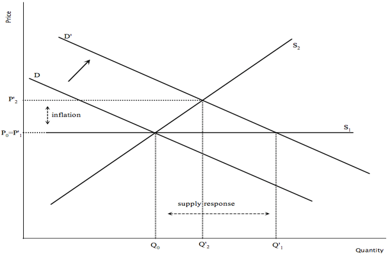
```

---

# Respuesta de la economía local
 
- Supongamos una transferencia de efectivo
 
- El hogar tratado comprará comida, pagará servicios, contratará trabajo...

--
 
- Posibles efectos:
   
- Supongamos que la oferta de alimentos es completamente altamente elástica, el efecto en precios es muy pequeño
 
- Por el contrario, si la oferta es muy inelástica, la demanda creciente solo generará inflación
 
 
- El efecto de tratamiento $\rho$ nos da una imágen parcial de los beneficios o perjuicios del programa
 
 

---


# Efectos multiplicadores
 
- En la localidad tratada, puede que no todos los individuos elegibles reciban el tratamiento
 
- Si los individuos tratados incrementan su ingreso en $\rho$ debido al tratamiento y compran comida de un individuo no tratado, el multiplicador local se define como:
  
$$m=\rho(1+\alpha_{T,NT})$$ 
 
donde $\alpha_{T,NT}$ es el impacto del incremento en una unidad momentaria del ingreso de los tratados sobre el ingreso de los no tratados
 
- $\rho \alpha_{T,NT}$ es el derramamiento del programa
 
- Los individuos no tratados se *contaminan*
 
- Potencialmente también hay *contaminación* en otros tratados $\alpha{T,T}$ y efectos de retroalimentación de los no tratados a los tratados $\alpha_{NT,T}$
 
 

---

# Efectos multiplicadores


```{r, out.width="65%",fig.cap='Fuente: Taylor & Filipski (2014)',fig.align='center'}
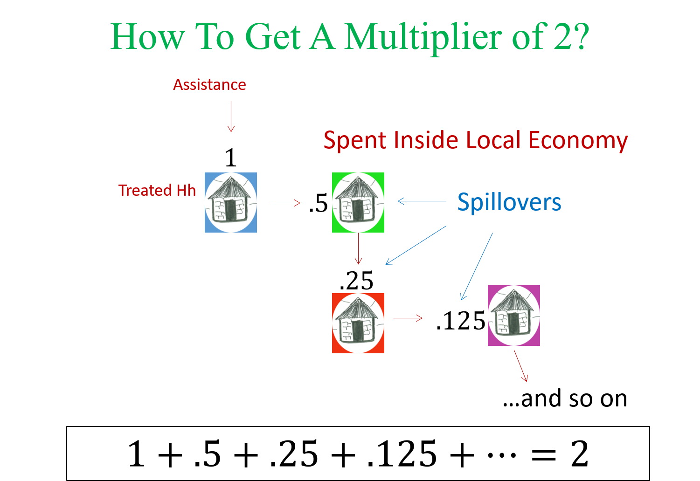
```

---

# Efecto total
 
- La cadena de efectos converge a un equilibrio general, siendo el efecto total:
  
$$m=\rho+m_{NT}$$
 
 
- El efecto total es más grande que el efecto que en el ingreso en los tratados $\rho$ cuando hay efectos de retroalimentación positiva en los no tratados
 
- Pero el efecto total puede ser negativo en el caso contrario
 
---

# Complicaciones en evaluaciones por aleatorización
 
- Muchos programas operan al mismo tiempo que otros en una misma región geográfica
 
- Las formas reducidas, sin un diseño explícito, no permiten interpretar mecanismos económicos
 
- No es lo mismo la evaluación de un piloto o un programa con una cobertura limitada y con bienes y servicios definidos a la evaluación de proyectos de gran escala
 
- No es posible comparar el efecto de políticas alternativas
 
 
---

# Características de un modelo LEWIE
 
- Capturan efectos directos e indirectos
 
- Consideran los vínculos de mercado que transmiten los efectos en las economías locales
 
- No es necesario crear grupos de tratamiento y control
 
- Pueden usarse para realizar simulaciones
 
- Identifican el efecto neto de intervenciones simultáneas
 
- Son un buen complemento de estudios experimentales
 


---

class: middle, center, inverse

# Construcción de un LEWIE

---

# Pasos para la construcción de un modelo LEWIE
 
- Modelar los hogares y empresas (de diversos tipos)

- Combinar los modelos en un modelos de economías locales

- Usar el modelo para simular impactos

---
 
# Modelos de hogares y empresas
 
- Especificamos problemas microeconómicos de optimización para obtener funciones de gasto y de producción
 
- Para esto usamos microdatos que caractericen los patrones de gasto, insumos, productos y lugares de compra y venta

---

# Modelos de hogares y empresas
 
```{r, out.width="50%",fig.cap='Fuente: Taylor & Filipski (2014)',fig.align='center'}
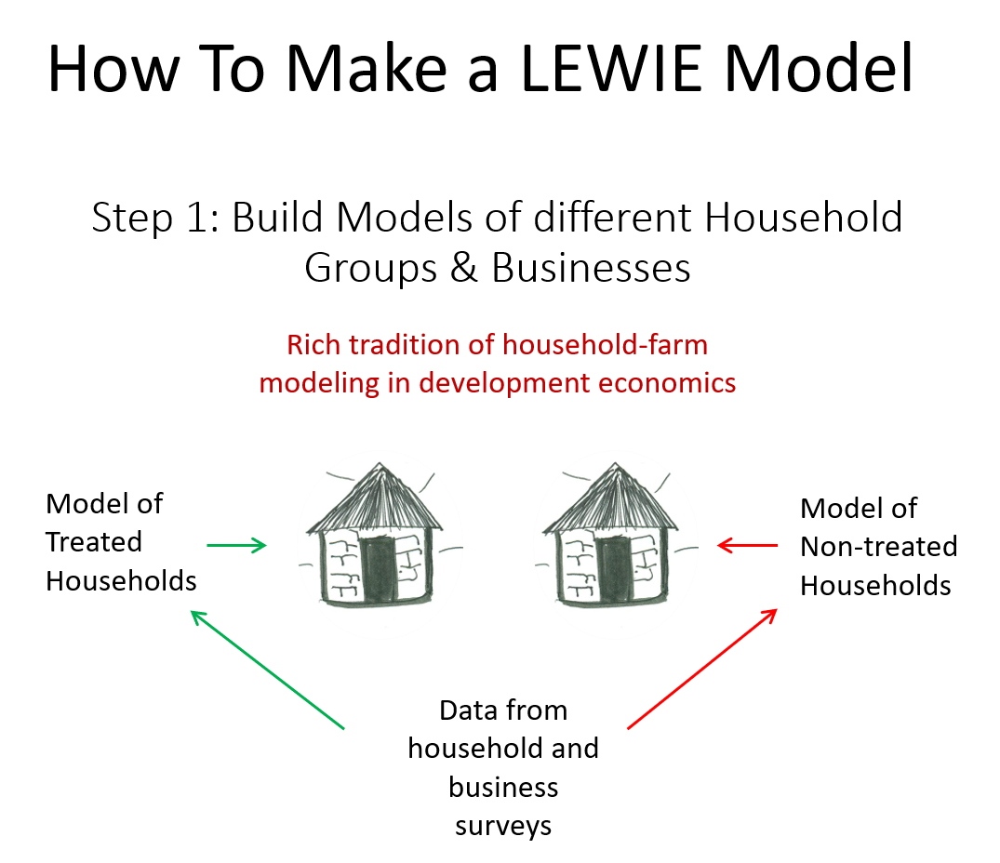
```

---

# Modelos de economía local
 
- Modelamos cómo interactúan los hogares y las empresas
 
- Las matrices de contabilidad social (SAM) nos ayudan a entender estos vínculos
 
---

# Modelos de economía local
 
```{r, out.width="50%",fig.cap='Fuente: Taylor & Filipski (2014)',fig.align='center'}
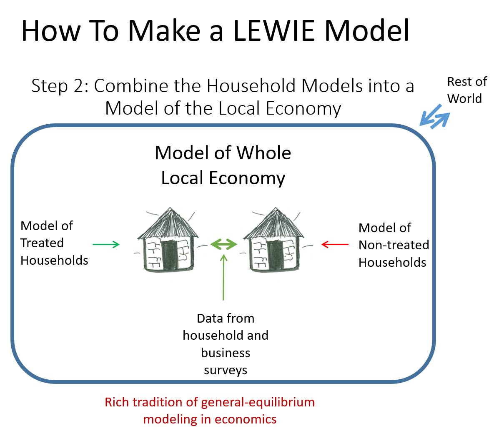
```


---

# Simulaciones
 
- Al caracterizar las relaciones en la economía local podemos simular los efectos de políticas
 
 
```{r, out.width="50%",fig.cap='Fuente: Taylor & Filipski (2014)',fig.align='center'}
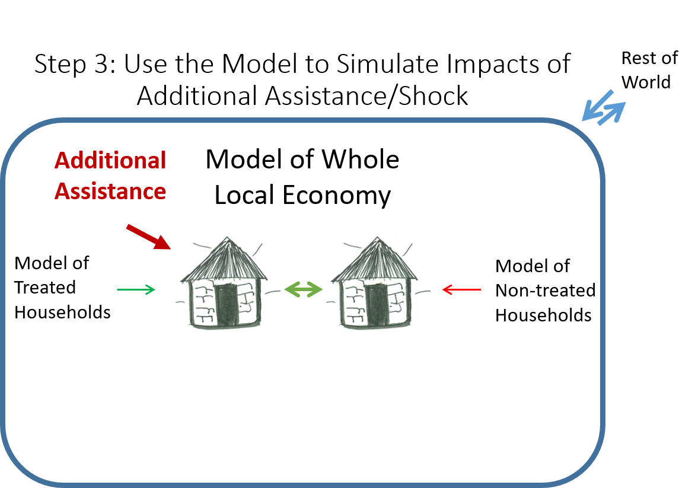
```

---

# Estimación

- La estimación del LEWIE se basa en un sistema de ecuaciones
 
- Para los hogares se definen tres tipos de ecuaciones:
  
  - Precios
  - Producción
  - Consumo e ingreso
 
 
- Se definen también ecuaciones de equilibrio de mercado:
   
  - Mercado de bienes
  - Mercado de factores
 
- La estimación consiste en usar los datos para encontrar los parámetros de las funciones de producción y de gasto
 
- Se soluciona el modelo usando las condiciones de equilibrio y se obtienen los precios
 
- Se emplean simulaciones Monte Carlo, por ejemplo, modificando el ingreso

---

class: inverse, middle, center

# Aplicación: ayuda a refugiados en Rwanda

---

# Contexto

.pull-left[
- Rwanda sufrió los efectos de un genocidio y el subsecuente desplazamiento de personas en 1994
 
- En la actualidad es un país pacificado
 
- En Rwanda viven alrededor de 150 mil refugiados
 
- La mayoría provenientes del Congo (DRC) y Burundi
]

.pull-right[
```{r, out.width="70%",fig.align='center'}

```
]


---

# Preguntas de investigación
 
- ¿Cómo se benefician o afectan las economías locales por la presencia de refugiados?
   
- ¿Qué régimen de ayuda es más efectivo? El WFP provee os formas de ayuda:
   
 
- Ayuda en especie. Las familias reciben una caja de alimentos con el 100\% de los requerimientos calóricos mínimos (maíz, legumbres, aceite y sal)
  
- Efectivo. Las familias reciben el equivalente de la cansta en efectivo vía su teléfono celular (con el que pueden comprar o retirar los fondos)
 
- Caracterizar la actividad económica en campos de refugiados, inspirados por el trabajo de Radford (1945)
 

---

# Sitios de estudio
 
- El estudio se realizó en tres zonas:
   
  - Nyabiheke. Había cambiado de en especie a efectivo dos meses antes del estudio
   
  - Kigeme. Entregaba ayuda en especie al momento del estudio
   
  - Gihembe. Había cambiado de en especie a efectivo 18 meses antes del estudio
 
 
- Los campos tienen la particularidad de ser semipermeables: los refugiados pueden salir y hacer intercambio con la economía local pero los ciudadanos ruandeses no tienen permitido entrar a los campos de refugiados
 
- Se estudian no solo los campos sino la economía local definina como el círculo de 10 kilómetros alrededor de cada campo
 
---

# Sitios de estudio

```{r, out.width="50%",fig.cap='Fuente: Taylor et al. (2016)',fig.align='center'}
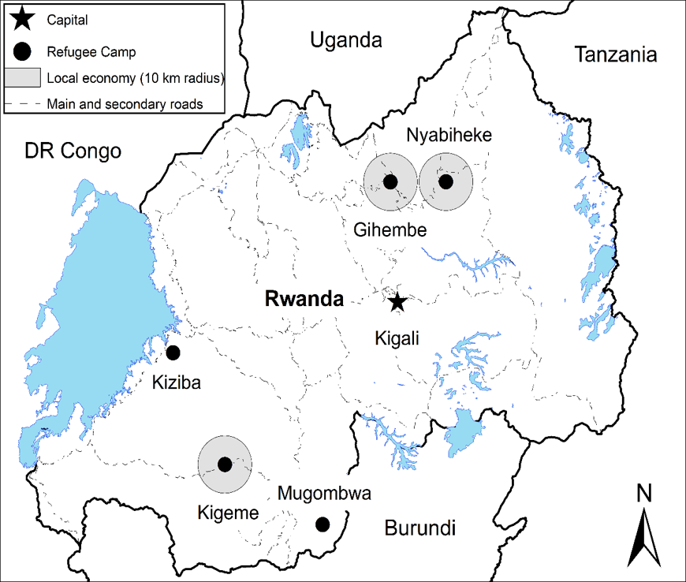
```


---

# Datos
 
- Encuestas en hogares en los tres campos y en hogares de la economía local
 
- Encuestas en negocios de refugiados y negocios en sitios de intercambio más importante de la economía local
 
- El muestreo de hogares refugiados se basó en un listado provisto por el WFP
 
- El muestreo en hogares de la economía local se basó en el registro de hogares provisto por las autoridades locales
 
- Se requieren datos detallados sobre:
   
- Productos, precios y cantidades consumidas
 
- Insumos y cantidades producidas
 
- Trabajo remunerado y contratado
 
- Para todo lo anterior, se requiere conocer el origen y el destino (campo, economía local o ROW)
 
---

# Características de los hogares
 
- Los hogares en la economía local participan en la agricultura y la ganadería con distintas intensidades entre campos
 
- Tanto refugiados como locales participan en los meracados de trabajo locales
 
- Tanto locales pero también refugiados participan en el comercio y otros negocios no agrícolas
 
- Los refugiados reciben y envía remesas
 
- Los refugiados en el campo de en especie venden los bienes que reciben para comprar otros (aunque a un precio por debajo del de mercado)
 
---

# Características de los hogares


```{r, out.width="50%",fig.cap='Fuente: Taylor et al. (2016)',fig.align='center'}
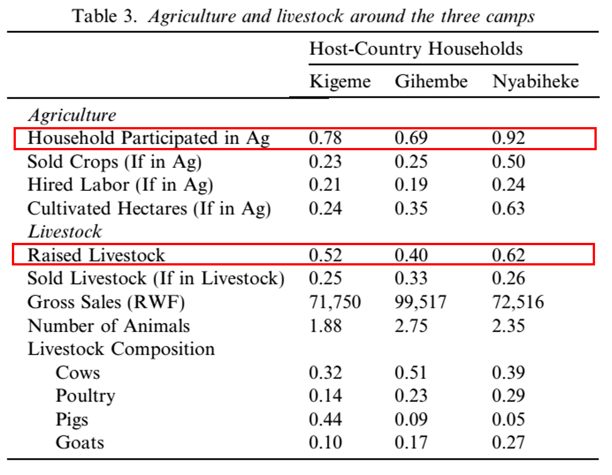
```

---


# Características de los hogares


```{r, out.width="100%",fig.cap='Fuente: Taylor et al. (2016)',fig.align='center'}
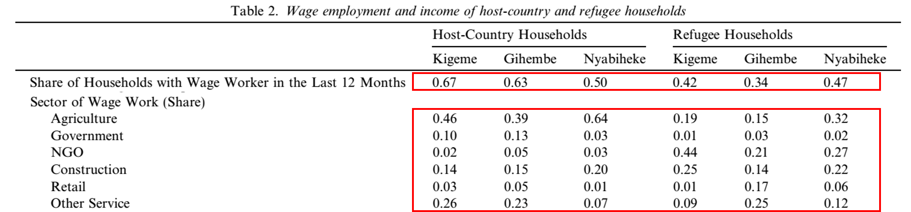
```

---


# Características de los hogares


```{r, out.width="100%",fig.cap='Fuente: Taylor et al. (2016)',fig.align='center'}
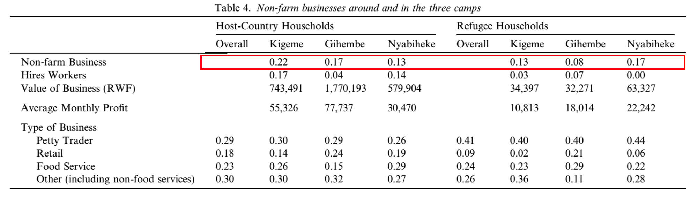
```

---

# Características de los hogares


```{r, out.width="100%",fig.cap='Fuente: Taylor et al. (2016)',fig.align='center'}
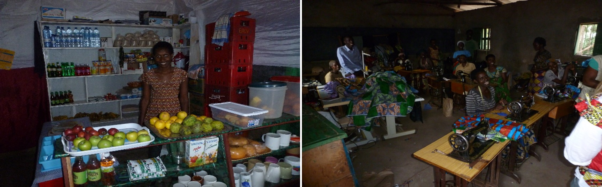
```

---

# Características de los hogares


```{r, out.width="100%",fig.cap='Fuente: Taylor et al. (2016)',fig.align='center'}
knitr::include_graphics("figures/LEWIE_remittances_table.png")
```

---

# Características de los hogares


```{r, out.width="90%",fig.cap='Fuente: Taylor et al. (2016)',fig.align='center'}
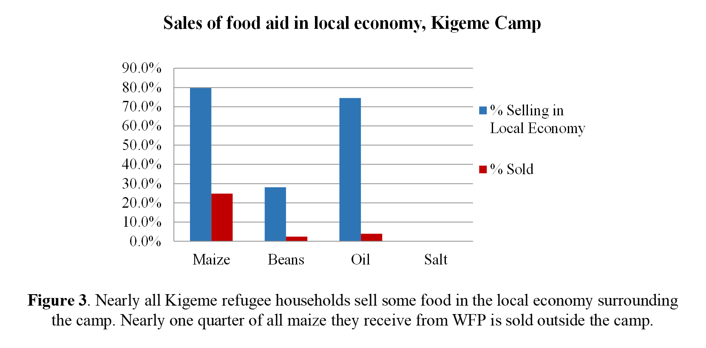
```

---

# Estimación de funciones de producción y de gasto
 
- Empleando los datos recolectados podemos estimar
 
- Las funciones de producción
 
- Las funciones de gasto
 
- Las demandas de factores
 
- Ver las tablas S8 y S9 del [apéndice en línea](http://www.pnas.org/content/pnas/suppl/2016/06/16/1604566113.DCSupplemental/pnas.1604566113.sapp.pdf)


---

# Efecto de un refugiado adicional
 
- Podemos simular el efecto de un refugiado adicional
 
- La llegada de un refugiado trae consigo una cantidad de dinero por la ayuda del WFP y otras ayudas
 
- Al interactuar con la economía local generan efectos multiplicadores
 
- El efecto total es superior al monto que ingresa por cada refugiado adicional
 
- Los efectos son considerablemente mayores en los campos con ayuda en efectivo

---

# Efecto de un refugiado adicional
 
```{r, out.width="50%",fig.cap='Fuente: Taylor et al. (2016)',fig.align='center'}
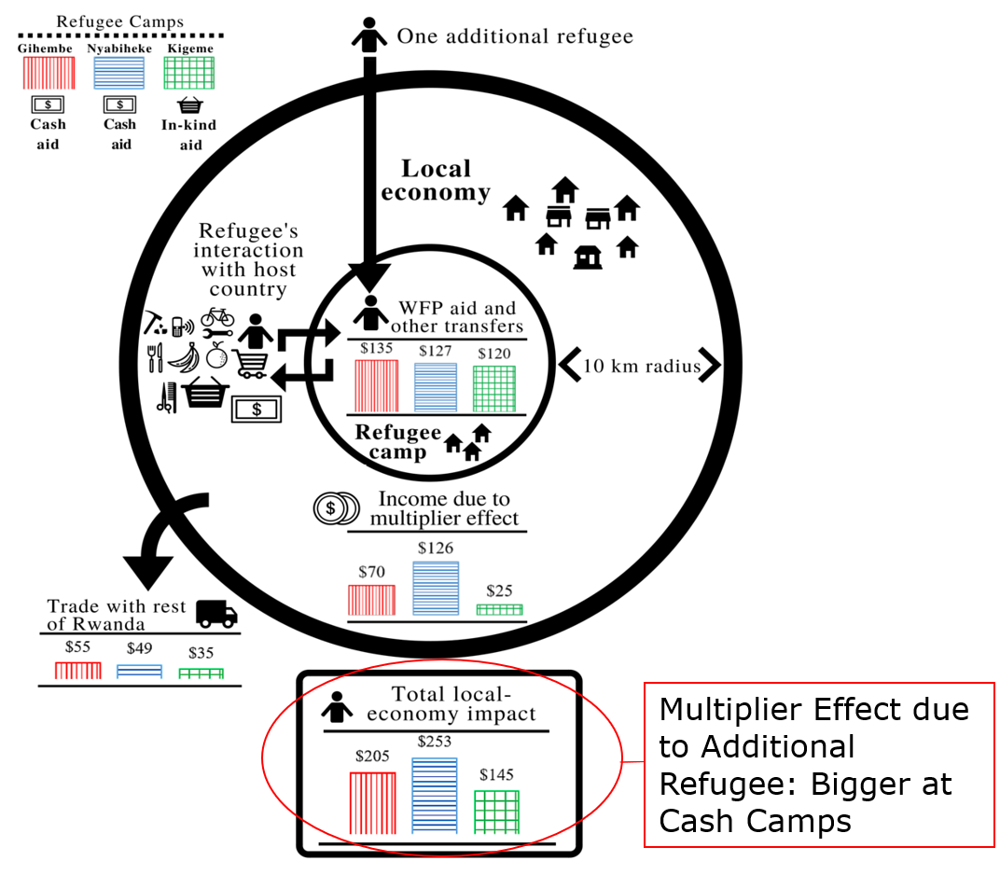
```

---


# Efecto de un refugiado adicional
 
```{r, out.width="50%",fig.cap='Fuente: Taylor et al. (2016)',fig.align='center'}
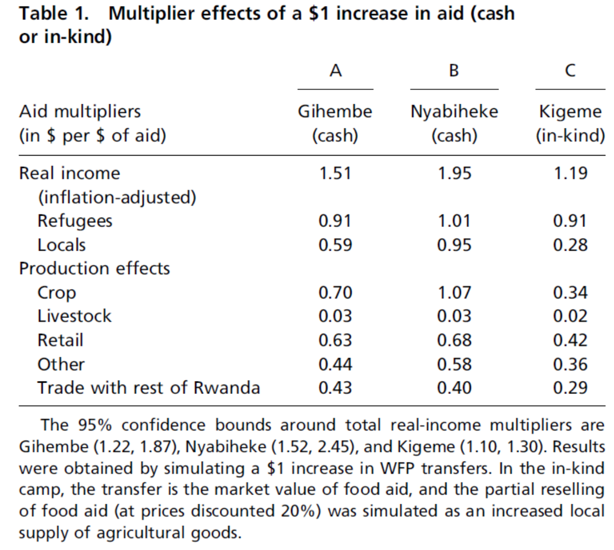
``` 
---

# Conclusiones
 
- La ayuda a refugiados en Rwanda genera más ingreso que la ayuda recibida del WFP
 
- Los derramamientos son de una magnitud menor en el campo con ayuda en especie
 
- Los benecifios para la economía local dependen de la posibilidad que tengan los refugiados de interactuar con la economía local
 
 
---

# Próxima sesión

- Hablaremos sobre cómo podemos incorporar técnias de aprendiza automático para estudiar problemas de inferencia

  - Athey, S., & Imbens, G. W. (2019). Machine learning methods that economists should know about. *Annual Review of Economics*, 11.

  - Varian, H. R. (2014). Big data: New tricks for econometrics. *Journal of Economic Perspectives*, 28(2), 3-28
  
---

class: center, middle

Presentación creada usando el paquete [**xaringan**](https://github.com/yihui/xaringan) en R.

El *chakra* viene de [remark.js](https://remarkjs.com), [**knitr**](http://yihui.org/knitr), y [R Markdown](https://rmarkdown.rstudio.com).

Material de clase en versión preliminar.

**No reproducir, no distribuir, no citar.**


