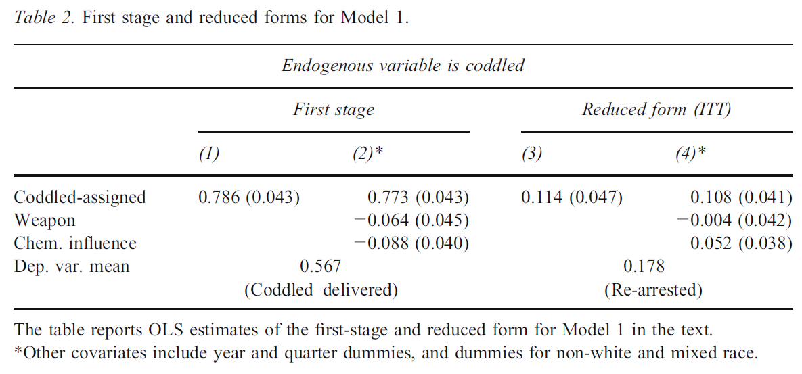
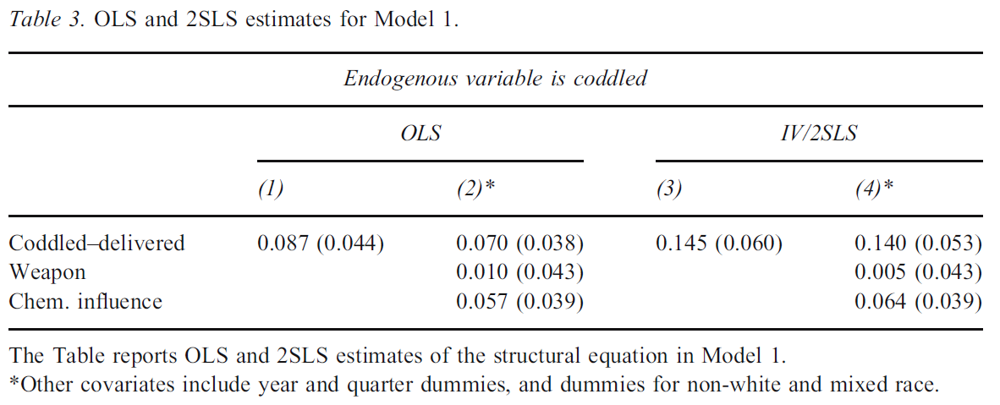

class: title-slide

```{r setup, include=FALSE}
knitr::opts_chunk$set(echo = FALSE, fig.path = "figures/")

library(tidyverse)
library(pacman)
library(janitor)
library(sandwich)
#library(nnet)
#library(mlogit)
library(readr)
library(clubSandwich)
library(modelsummary)
library(estimatr)

p_load(tidyverse, foreign, reshape2, psych, qwraps2, forcats, readxl, 
       broom, lmtest, margins, plm, rdrobust, multiwayvcov,
       wesanderson, sandwich, stargazer,
       readstata13, pscore, optmatch, kdensity, MatchIt, bootstrap, matlib, dplyr)

xfun::pkg_load2(c('base64enc', 'htmltools', 'mime'))
```

```{css, echo = FALSE}
.huge .remark-code { /*Change made here*/
  font-size: 200% !important;
}
.tiny .remark-code { /*Change made here*/
  font-size: 60% !important;
}
```

.title[
# Sesión 8. Econometría del LATE
]
.subtitle[
## Evaluación de Programas Sociales
]
.author[
### Irvin Rojas <br> [rojasirvin.com](https://www.rojasirvin.com/) <br> [<i class="fab fa-github"></i>](https://github.com/rojasirvin) [<i class="fab fa-twitter"></i>](https://twitter.com/RojasIrvin) [<i class="ai ai-google-scholar"></i>](https://scholar.google.com/citations?user=FUwdSTMAAAAJ&hl=en)
]

.affiliation[
### Centro de Investigación y Docencia Económicas <br> División de Economía
]

---
# Agenda

1. Desarrollar la terminología de variables instrumentales

1. Mostrar la equivalencia econométrica del LATE estudiado con el modelo de resultados potenciales

1. Mostrar los resultados formales de la econometría de variables instrumentales

---

class: inverse, middle, center

# Variables instrumentales y LATE

---

# Recordemos el experimento de KIPP

- Algunos alumnos ganaron la loteria y otros no

- Algunos de los que ganaron la loteria optaron por entrar a una escuela charter y otros no

- Recordemos que se espera que la variable de asignación $Z$ en el modelo de resultados potenciales) sea independiente de la variable de interés

---

# Terminología

- **Primera etapa**: es el efecto causal de la asignación sobre el cumplimento

$$\phi=E(D_i|Z_i=1)-E(D_i|Z_i=0)$$
- **Forma reducida**: es la diferencia en $y$ entre grupos de asignación

$$\rho=E(y_i|Z_i=1)-E(y_i|Z_i=0)$$
- **LATE**: es la diferencia en $y$ entre a quienes se le asigna el tratamiento y quienes no, dividida por la diferencia en cumplimiento

$$\lambda_{LATE}=\frac{\rho}{\phi}$$

---

class: inverse, center, middle

# Variables instrumentales en investigación criminológica


---

# Variables instrumentales en investigación criminológica

- Angrist (2006) estudia un experimento bastante particular: aleatorizar la respuesta policíaca

- ¿En qué consistió la intervención?

--

- $y_i$: tasa de reincidencia en conductas de violencia doméstica

- $T_i=\begin{cases} 1\quad \text{si apercibido} \\ 0\quad \text{otro caso}\ \end{cases}$

--

- Se muestra como el ITT puede no reflejar la efectividad de la intervención debido al efecto de *dilusión* provocado, en este caso, por desviaciones con respecto a la forma de enfrentar un episodio policíaco

---

# Diferencias en las respuestas efectivas
|| |  | Recibido % (N) | |
|:---|:---|:---:|:---:|:---:|
|| | Arrestado | Apercibido | Total |
|| Arrestar | 98.91 (91) |	1.09 (1)|		29.3 (92)|
| **Asignado**| Apercibir | 20.27 (45)	| 79.73 (177)	| 	70.7 (222)| 
|| Total   | 43.31 (136) |	56.69 (178) |	 	100 (314)|

- En el estudio original, lo que llamamos *apercibir* tuvo en realidad dos componentes: *aconsejar* y *separar*, pero para facilitar el análisis usaremos solo *arrestar* por un lado y *apercibir* por el otro

- ¿Qué observamos sobre a las desviaciones con respecto al tratamiento asignado?

--

- Noten que cuando el tratamiento asignado era arrestar, efectivamente se arrestó al 98.91% de los individuos

- En cambio, noten que 20.27 % de los 222 asigados a ser apercibidos fueron en efecto arrestados

- ¿Cómo ocurre el sesgo de selección en este caso?
---

# Sesgo de selección

- Algunos individuos se comportaron violentos, por lo que fueron arrestados a pesar de ser asginados a apercibimiento

- Por tanto, si comparamos $y$ entre aquellos individuos apercibidos y no apercibidos, no tomamos en cuenta que aquellos no apercibidos (por tanto, arrestados) puedieran ser más violentos, sobreestimando el efecto de la política de apercibimiento

---

# LATE

- La primera etapa es el efecto causal en la probabilidad de recibir el tratamiento de apercibimiento por el hecho de haber sido asignado a ese tratamiento: $E(D_i|Z_=1)-E(D_i|Z_=0)=0.797-0.011=0.786$
  
- La forma reducida (o ITT) es el efecto causal de la asignación al tratamiento sobre la tasa de reincidencia: $E(y_i|Z_=1)-E(y_i|Z_=0)=0.211-0.097=0.0.114$

--

- El ITT ignora el hecho de que algunos asignados a apercibimiento fueron arrestados

- Sabemos que el LATE está dado por $\lambda_{LATE}=\frac{ITT_y}{ITT_D}=\frac{0.114}{0.786}=0.145$

- Los datos de los autores reportan que si nos fijáramos solo en las diferencias entre por tipo de tratamiento obtendríamos, $E(y_i|D_=1)-E(y_i|D_=0)=0.216-0.129=0.087$, es decir, casi la mitad del LATE

- Pero como $D$ no es aleatoria, dicha comparación no es correcta

---

class: inverse, middle, center

# La econometría del LATE

---

# Motivación con un estadístico de Wald

- Pensemos en un modelo con efectos constantes de tratamiento: $y_{1i}-y_{0i}=\alpha$

- La variable de resultados está determinada por $y_{0i}=\beta+\varepsilon_i$, donde $\beta=E(y_{0i})$

- Entonces, el modelo de resultados potenciales es:

$$y_i=\beta+\alpha D_i+\varepsilon_i$$
- Si $D_i$ no es independiente de $y_{0i}$ (es decir, $y_{0i}$ no es independiente del error), entonces una diferencia de medias entre grupos de $D$ no produce un estimador consistente de $\alpha$

--

- Ahora supongamos que tenemos un **instrumento** $z_i$ tal que $z_i\perp y_i$, es decir, $E(\varepsilon_i|z_i)=0$

--

- Evaluemos la esperanza de $y_i$ cuando $z_i=1$ y cuando $z_i=0$:

$$
\begin{aligned}
E(y_i|z_i=1)&=\beta+\alpha E(D_i=1) \\
E(y_i|z_i=0)&=\beta+\alpha E(D_i=0) \\
\end{aligned}
$$
- Restando y despejando obtenemos $\alpha=\frac{E(y_i|z_i=1)-E(y_i|z_i=0)}{E(D_i=1)-E(D_i=0)}$, lo cual es conocido como un *estadístico de Wald*

---

# Mínimos cuadrados en dos etapas (MC2E)

- **Modelo estructural**

$$y_i=X_i'\beta+\alpha D_i+\varepsilon_i$$

- Podemos entender la estimación del efecto causal usando dos etapas

--

- **Primera etapa**

$$D_i=X_i'\pi_0+\pi_1z_i+\eta_i$$
donde $pi_i$ es el efecto causal de la asignación sobre el cumplimiento

- Cuado $D_i$ u $z_i$ son ambas dicotómicas, $\pi_1$ da la proporción de la población que son cumplidores

---

# Mínimos cuadrados en dos etapas (MC2E)

- **Segunda etapa**
$$y_i=X_i'\beta+\alpha \hat{D}_i+\varepsilon_i$$
--

- Esta es la forma de pensar el procedimiento, pero en la práctica nunca hacemos esto manualmente

  - Noten que $\hat{D}_i$ es estimada, por lo cual se ignora la variabilidad muestral de la primera etapa y los errores estándar serían inconsistentes

--

- Nota: el estimador de Wald es igual al estimador de MC2E cuando no hay $X$ y cuando $Z$ y $D$ son binarias

---

# Mínimos cuadrados en dos etapas (MC2E)


- **Forma reducida**

$$
\begin{aligned}
y_i&=X_i'\beta+\alpha(X_i'\pi_0+\pi_1z_1+\eta_i)+\varepsilon_i \\
&=X_i'\delta_0+\delta_1z_i+\nu_1
\end{aligned}
$$
donde $\delta_1=\alpha\pi_1$ es el coeficiente de forma reducida sobre la variable de asignación

--

- Noten que esto implica que $\alpha=\delta_1/\pi_1$

- Es decir, $\alpha_{MC2E}$ puede interpretarse como la versión reescalada del coeficiente de forma reducida usando el efecto causal de la primera etapa


---

# Efectos estimados

.pull-left[

**Primera etapa**

- Vemos los resultados de la primera etapa en el artículo

- Versión simple:

$$apercibido_i=\pi_0+\pi_1T_i+\eta_i$$

- Con controles:
$$apercibido_i=\pi_0+\pi_1T_i+X_i'\Pi +\eta_i$$
- Noten que el 0.786 es exactamente lo que se encontraba al hacer las diferencias de medias
]


.pull-right[
```{r, out.width="120%",fig.cap='Fuente: Angrist (2006)',fig.align='center'}

```
]

---

#Efectos estimados

.pull-left[

**Efecto del tratamiento**

- Noten que con nuestro estimador de MC2E obtenemos exactamente lo que antes habíamos calculado como $\delta_1/\pi_1=0.145$

- Vean que al estimar la ecuación estructural por MCO obtenemos un coeficiente cercano a 0.070

- Más aún, sabemos que el coeficiente de MCO es inconsistente

]


.pull-right[
```{r, out.width="120%",fig.cap='Fuente: Angrist (2006)',fig.align='center'}

```
]

---

# LATE es igual ATET en este caso

- Noten que este estudio tiene lo que se conoce como *no cumplidores de un solo lado*

|| |  | Recibido % (N) | |
|:---|:---|:---:|:---:|:---:|
|| | Arrestado | Apercibido | Total |
|| Arrestar | 98.91 (91) |	1.09 (1)|		29.3 (92)|
| **Asignado**| Apercibir | 20.27 (45)	| 79.73 (177)	| 	70.7 (222)| 
|| Total   | 43.31 (136) |	56.69 (178) |	 	100 (314)|

- Cuando la asignación es **apercibir**, en el 20.27% de los casos la acción fue arrestar y en el 79.73% efectivamente fue apercibir

- En cambio, cuando se indica **no apercibir**, es decir, arrestar, la adopción es casi perfecto (salvo un caso)

--

- En otras palabras, en este caso no hay **siempre cumplidores**

- No hay individuos que hayan sido *apercibidos* independientemente de la asignación


---

# LATE es igual ATET en este caso

- Recordemos que el grupo de quienes reciben el tratamiento está compuesto de los cumplidores y los siempre adoptadores

- En este caso en particular:

$$\lambda_{LATE}=E(y_{1i}-y_{0i}|C_i=1)=E(y_{1i}-y_{0i}|D_i=1)=ATET$$
--

- Esto ocurre en los casos en que:

  - Algunos de los asignados al tratmiento, $z_i=1$ lo reciben mientras otros no
  
  - Nadie de los asignados al control, $z_i=0$ tiene acceso al tratamiento

---

class: inverse, middle, center

# Estimador de variables instrumentales

---

# Estimador de variables instrumentales

- Consideremos el modelo
$y=\beta_0+\beta_1 x_1+\beta_2 x_2+\ldots+\beta_k x_K+u$

donde $x_k$ está correlacionado con $u$

--
 
- Y consideremos la proyección lineal de $x_K$ en las variables exógenas:

$$x_K=\delta_0+\delta_1 x_1+\delta_2 x_2+\ldots+\delta_{K-1}x_{K-1}+\theta_1 z_1+e_K$$

donde $E(r_K)=0$ y $r_K$ no está correlacionado con las $x_j$ ni con $z_1$

--

- Supongamos que tenemos una variable instrumental $Z_1$ tal que:

  - **Exclusión**: $z_1$ no pertenece a la ecuación de $y$, es decir, $Cov(z_1,u)$
  
  - **Relevancia**: $\theta_1\neq 0$
  
entonces $z_1$ es una variable instrumental para $x_k$


---

# Estimador de variables instrumentales


- Escribamos el modelo como $y=x\beta+u$, donde $x=(1,x_2,\dots,x_K)$ y definamos $z=(1,x_2,\ldots,x_{K-1}),z_1$

- Premultiplicamos la ecuación de $y$ por $z'$ y tomamos el valor esperado:

$$E(z'y)=E(z'x)\beta+E(z'u)$$

--

- Por la condición de eclusión sabemos que $E(z'u)=0$, por tanto, si $E(z'x)$ es de rango completo:

$$\beta=E(z'x)^{-1}E(z'y)$$


- Y sustituyendo los análogos muestrales:

$$\hat{\beta}_{VI}=\left(\frac{1}{N}\sum_iz_i'x_i\right)^{-1}\left(\frac{1}{N}\sum_iz_i'y_i\right)=(Z'X)^{-1}Z'Y$$
---

# Variables instrumentales y mínimos cuadrados en dos etapas

- En nuestro problema del LATE, el instrumento será la asignación al tratamiento

  - Si $Z$ es aleatorio, se cumple la restricción de exclusión

- La variable *endógena* es la adopción, por lo que la variable de asignación funciona como un instrumento de la adopción

--
  
- En la práctica, puede haber más de un instrumento y más de una variable endógena y el método de estimación usado es **mínimimos cuadrados en dos etapas**

- Reservaremos el término *estimador de variables instrumentales* al caso en que tenemos tantas variables endógenas como instrumentos, es decir, cuando el modelo esta *exactamente identificado*

- En este curso solo usaremos modelos exactamente identificados

---

# Propiedades del estimador de VI

- No vamos a ocuparnos de las pruebas formales

- Noten que el estimador de nuevo puede escribirse como funciones de medias muestrales, por tanto, recurrimos a LGN y TLC para probar su consitencia y distribución asintótica

---

# Una nota sobre instrumentos débiles

- Hay cosas que no abordaremos en el curso, como el hecho de que, a diferencia del estimador de MCO, el estimador de VI es **sesgado**

- Es decir, en muestras grandes, el estimador de VI solo se acerca al parámetro poblacional

--

- Más aún, se puede mostrar que:

$$sesgo_{VI}=sesgo_{MCO}\frac{1}{F+1}$$

donde $F$ es el estadístico $F$ en una prueba de significancia conjunta de los regresores de la primera etapa

- Es decir, el sesgo se aproxima al sesgo del estimador de MCO cuando no hay primera etapa

- En la práctica, nos fijamos que la primera etapa sea válida al observar los coeficientes estimados sobre $Z_i$

- Y la regla de dedo usada en econometría es que $F>0$ en la primera etapa


---

# Próxima sesión

- Asigné a las tres personas que faltaban de escoger exposición

- Asigné a las cuatro personas que faltaban de escoger entrada de blog

- La siguiente semana veremos detalles finos para la estimación

--

- Martes:

  - McKenzie, D. (2012). Beyond baseline and follow-up: The case for more T in experiments. *Journal of development Economics*, 99(2), 210-221.
  - Rojas Valdes, R.I., Wydick, B., & Lybbert, T.J. (2020). Can Hope Elevate Microfinance? Evidence from Oaxaca, Mexico. Forthcoming in *Oxford Economic Papers*.
  
- Jueves:

  - MHE, Capítulo 8
  - Ho, D. E., & Imai, K. (2006). Randomization inference with natural experiments: An analysis of ballot effects in the 2003 California recall election. *Journal of the American Statistical Association*, 101(475), 888-900.

---

class: center, middle

Presentación creada usando el paquete [**xaringan**](https://github.com/yihui/xaringan) en R.

El *chakra* viene de [remark.js](https://remarkjs.com), [**knitr**](http://yihui.org/knitr), y [R Markdown](https://rmarkdown.rstudio.com).

Material de clase en versión preliminar.

**No reproducir, no distribuir, no citar.**


